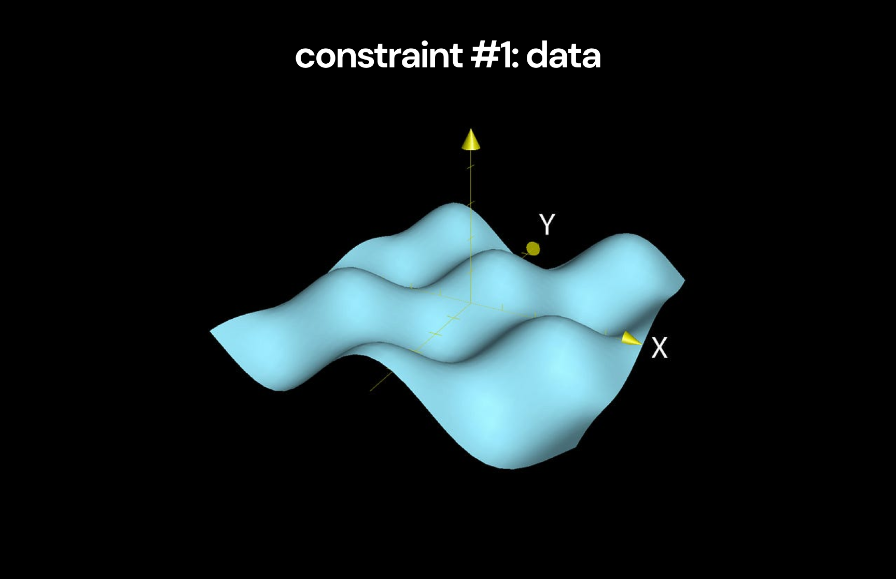
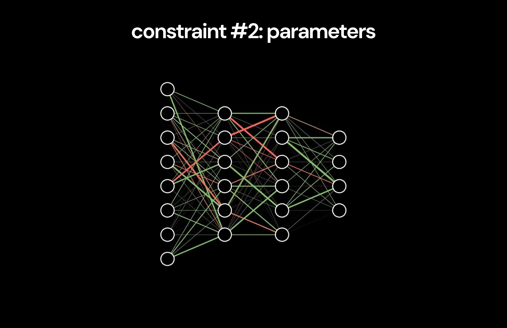

# 深度学习

深入探讨深度学习的整个历史，重点介绍了将我们从简单的前馈网络带到GPT-4o的一系列创新。

对于每一个关键的里程碑，我都在这个仓库中包含了重要的论文，并附上了我的笔记、重要直觉和数学解释，以及相关的pytorch示例实现。

本页面的其余部分是我对我们从这段历史中可以学到的一切的总结，以及它告诉我们关于深度学习未来的启示，灵感来源于[《历史的教训》](https://www.amazon.com/Lessons-History-Will-Durant/dp/143914995X) by Will & Ariel Durant。

> [!IMPORTANT]
>
> **本项目的设计旨在让每个人通过阅读本页面其余部分的概述就能获得大部分价值。**
>
> 然后，想要了解每个创新的技术细节的人，可以通过[资源](#资源)部分的链接，深入探索仓库的其余内容。

> [!NOTE]
>
> 欲了解更多背景信息，请查看[原始的推特线程](https://x.com/MajmudarAdam/status/1794190796411027791)

> [!NOTE]
>
> 感谢[Pavan Jayasinha](https://x.com/pavanjayasinha)和[Anand Majmudar](https://x.com/Almondgodd)在我制作过程中提供的持续反馈 😄

## 目录

- [概述](#overview)
  - [1. 限制](#2-constraints)
    - [1.1. 数据](#11-data)
    - [1.2. 参数](#12-parameters)
    - [1.3. 优化与正则化](#13-optimization--regularization)
    - [1.4. 架构](#14-architecture)
    - [1.5. 计算](#15-compute)
    - [1.6. 计算效率](#16-compute-efficiency)
    - [1.7. 能源](#17-energy)
    - [1.8. 限制与杠杆](#18-constraints--leverage)
  - [2. 叙事](#2-narratives)
  - [3. 灵感](#3-inspiration)
  - [4. 智能](#4-intelligence)
  - [5. 未来](#5-future)
- [资源](#resources)
  - [主题](#topics)
  - [实现](#implementations)
  - [论文](#papers)

 

# 概述

我深入探讨的最有趣部分来自于注意到所有关键进展中存在的一个明显趋势，这彻底改变了我对深度学习的理解：

> [!IMPORTANT]
>
> **有7个简单的限制，限制了数字智能的能力：**
>
> 1. 数据
> 2. 参数
> 3. 优化与正则化
> 4. 架构
> 5. 计算
> 6. 计算效率
> 7. 能源
>
> **深度学习的整个历史可以看作是这些限制逐渐提升的系列进展**，使得越来越智能的系统得以创建。

在不首先理解我们是如何走到今天的之前，我们无法理解我们将要去往何方——而我们也无法理解我们是如何走到今天的，除非理解这些一直主导进展速度的限制。

通过理解这些限制，我们还可以探索一些相关的问题：

- 深度学习是如何进步的？
- 推动深度学习进步的思想源自何处？
- 我们关于数字智能的叙事是如何随着时间变化的？
- 深度学习教会我们关于我们自身智能的哪些东西？
- 深度学习的未来将会如何发展？

那么，让我们从最基本的原理开始，理解这些限制。

# 1. 限制

我们可以将智能定义为准确建模现实的能力[^1]。从实际角度来看，我们关注的是那些对执行具有经济价值的任务有用的现实模型[^2]。

深度学习的目标是通过以下方式为这些有用的任务产生准确的现实模型：

1. 将描述现实的真实模型视为复杂的概率分布[^3]
2. 创建能够建模复杂概率分布的神经网络
3. 训练这些网络以学习建模潜藏于现实背后的概率分布

从这个角度来看，利用深度学习创造智能只需要两个步骤：

1. 收集关于现实的有用信息（收集数据）
2. 创建一个能够有效从这些信息中学习的神经网络（建模数据）

提高我们模型智能的唯一方法就是提升我们完成这两个步骤的能力。

考虑到这一点，我们可以看看支配这个过程的限制。让我们从理解数据的限制开始。

 

[^1]: 每个人对智能的定义不同，这些定义在不同的上下文中都有用，但没有一个能够完整地表达这个词的含义。人们可能会对这个定义的具体内容有所异议。我选择这个定义是为了简洁起见，清楚地框定我们试图通过深度学习从经济角度实现的目标——我在这里不太关心它的哲学含义。

[^2]: Karl Friston的[自由能原理](https://www.nature.com/articles/nrn2787)表明，这一定义的智能在大脑的背景下也是有效的（小心，论文解释时使用了不必要的数学复杂性，但它描述的核心概念是简单的）。值得注意的是，智能系统创建世界模型，然后利用这些模型进行_主动推理_来修改它们的环境。

[^3]: 这个想法一开始可能看起来不直观。但它实际上说的是非常简单的事情：（1）现实有一套规则来支配发生的事情（2）我们可以通过为可能发生的事情分配概率来建模这些规则，考虑到已经发生的事情（3）因此，这些模型是概率分布。再一次，[自由能原理](https://www.nature.com/articles/nrn2787)支持这种现实建模的观点。

## 1.1. 数据

我们已经确定，深度学习的目标是建模描述现实的概率分布。

我们将尝试为特定任务建模的分布称为 _真实分布_。为了了解真实分布，我们从中收集许多样本。这些样本组成了 _数据集_。

数据集包含了关于真实分布的一些信息，但它并不包含 _关于真实分布的所有信息_[^4]。因此，数据集表示的是对真实分布的近似，我们称之为 _经验分布_。

**在最好的情况下，我们可以期望我们的神经网络学会建模这个经验分布[^5]。**

然而，我们最初的目标是建模真实分布。为此，我们需要经验分布**是对真实分布的良好近似**。这个近似的质量决定了在数据集上训练的模型能够达到的上限。

这是神经网络智能的第一个限制。

> [!NOTE]
>
> **限制 #1：模型的好坏只能和其训练数据集的质量相当。**
>
> 具体来说，模型能够逼近真实分布的上限由数据集中包含的关于真实分布的信息量决定。

 

[^4]: Assuming the true distribution we're trying to model is sufficiently complex to the point where including all information about it in the dataset would be intractable. This is almost always the case in deep learning.
[^5]: Assuming the model perfectly represents all information that exists within the dataset, which rarely happens.

### A Good Approximation

To make the empirical distribution a better approximation of the true distribution, we need to include more information about the true distribution in the dataset.

We can increase the total information in the dataset by the information in each individual sample (intuitively, this means using samples that are more informative for the relevant task).

We can also increase the information in the dataset by adding more samples that offer new information about the true distribution[^6].

**To simplify, there are two ways to improve the quality of the dataset:**

1. data quality
2. data quantity

This is not because more data is always good[^7], but because we want more information about the true distribution in the dataset so the model can learn a sufficient approximation of it.

With this understanding of the data constraint and how to improve the quality of datasets, we can look at how progress in this dimension has impacted the history of deep learning.

 

[^6]: This is analogous to how adding more terms to a Taylor series yields a function closer to the original. Approximations improve with more information about the true function.
[^7]: In fact, you can think of examples where more data makes no difference. For example adding the same image to a dataset (or two images similar to each other) doesn't improve the quality of the model created. It's because these new data points don't add much new information about the true distribution.

### Breakthrough #1: Large Labeled Datasets

Early machine learning relied on datasets collected by individual research teams. Despite the development of effective approaches to deep learning, datasets weren't large enough to prove their advantages.

The introduction of datasets like [MNIST](https://en.wikipedia.org/wiki/MNIST_database) and [ImageNet](https://en.wikipedia.org/wiki/ImageNet) drastically increased the availability of high quality datasets large enough to effectively train deep learning models.

Early [CNNs](/01-deep-neural-networks/02-cnn/03-cnn.ipynb) like [LeNet](/01-deep-neural-networks/02-cnn/02-le-net.pdf) and [AlexNet](/01-deep-neural-networks/03-alex-net/01-alex-net.pdf) used these datasets to show that deep neural networks could compete with the traditional machine learning approaches used at the time.

It's easy to take for granted the impact of these datasets now, as they have long been obselete - but they clearly had a huge impact on the field. Notably, AlexNet, which [completely changed the field of deep learning](/01-deep-neural-networks/03-alex-net/01-alex-net.pdf), could not have existed without the creation of the ImageNet dataset.

**The introduction of large labeled datasets can be seen as the first breakthrough in pushing the data constraint toward larger datasets.**

Though useful, these datasets were inherently unscalable due to the manual labeling process they rely on. In order to push the data constraint to the next level with even larger datasets, a new approach to data was needed.

 

### Breakthrough #2: Unlocking the Internet

The internet is the most obvious source of massive amounts of data that could plausibly be used for deep learning. However, it was initially unclear how to use this data to train a deep learning model.

Unlike labeled datasets, internet data is not created for a specific tasks, so it didn't appear to contain high quality data that could contribute to training a specific model. For this reason, internet data appeared to be unusable in deep learning for a long time[^8].

[BERT](/04-transformers/02-bert/03-bert.ipynb) completely changed this. BERT popularized the **transfer learning** paradigm now used by all large language models (including [GPTs](/04-transformers/04-gpt/03-gpt.ipynb)) - the model was _pre-trained_ on a large portion of the internet (high quantity, unpredictable quality), and then _fine-tuned_ on smaller datasets (low quantity, high quality).

**For the first time ever, BERT showed that we could actually make internet-scale datasets useful.**

The results also shocked the broader tech community - for example, [causing a Google executive to express](https://x.com/TechEmails/status/1756765277478621620) that an AI system would inevitably replace Google search in the near future.

For those curious, the [LoRA](/04-transformers/05-lora/02-lora.ipynb) paper further developed on why the transfer learning paradigm developed by BERT and used by all modern LLMs may be so effective.

 

[^8]: There was not powerful enough compute or good enough architectures to process the scale of internet datasets effectively for a long time.

### Breakthrough #3: Training Assistants

[BERT](/04-transformers/02-bert/03-bert.ipynb) and the [GPTs](/04-transformers/04-gpt/03-gpt.ipynb) were technically impressive but didn't immediately reach the mainstream until the release of ChatGPT.

[InstructGPT](/04-transformers/06-rlhf/05-rlhf.ipynb) was the breakthrough that enabled this. It used [RLHF](/04-transformers/06-rlhf/) techniques to fine-tune the base GPT-3 model using a human generated dataset of question-answer pairs deemed good responses for a helpful assistant.

By learning to behave effectively as an assistant, InstructGPT created the practical communication style that enabled ChatGPT to succeed.

**The success of InstructGPT is an indication of how high-leverage data quality can be when fine-tuning language-models.**

Though many fine-tuned models existed before the instruct series, InstructGPT was far preferred to almost everything else at the time due to the high quality data it was trained on.

 

### Beyond Internet Data

How much more can we improve the quality of the datasets deep learning models are trained on to improve the capacity for models to become intelligent?

The amount of data generated on the internet is increasing exponentially, which should continue to provide a source of increasingly large datasets to train on[^9].

However, there's another question about the quality of the data on internet-scale datasets. We want our systems to model reality - whereas the internet can be understood as a (highly) lossy compression of the true laws of reality[^10].

Because of this, the abundance of humanoid robots may present a new means of data collection for deep learning models that gives direct access to information about reality - which makes [OpenAI & Microsoft's investment and collaboration with Figure](https://www.reuters.com/technology/robotics-startup-figure-raises-675-mln-microsoft-nvidia-other-big-techs-2024-02-29/) particularly interesting.

Regardless, current scaling laws have shown that current models are far from reaching the capacity of the information available in internet-scale datasets, meaning we may be far away from the point where data becomes the constraint again.

 

[^9]: This may not actually be sufficient to keep increasing the quality of models, as a recent [analysis of zero-shot learning](https://arxiv.org/abs/2404.04125) shows that large language models ability to perform tasks increases logartihmically with the amount of relevant data in the dataset.
[^10]: The internet is a lossy compression of the entirety of human knowledge, with lot's of noise (complex and contrasting intentions behind different posts). Additionally, human knowledge itself is a very lossy (and partially inaccurate) compression of the laws of reality.

### Modeling Data

Now that we've understood the data constraint, we can explore what constrains how effectively the neural network can model the data.

This determines how close to modeling the empirical distribution the model will get, which corresponds with its intelligence.

The first constraint that determines the capacity for the model to learn the empirical distribution is the number of parameters in the neural network.

 

## 1.2. Parameters

The model needs to have enough _representational capacity_ to be able to learn the empirical distribution of the dataset.

This means the neural network needs to have parameters to provide enough degrees of freedom to accurately model the distribution. In practice, it's challenging to predict the minimal number of parameters needed to fully model a dataset.

However, when the amount of information in the dataset is far beyond what the network is capable of modeling, the easiest way to improve the network is to scale up the number of parameters - which can mean increasing the depth of the network and adding more parameters per layer.

With modern internet-scale datasets, the complexity is massive, so the approach of adding more parameters shows no signs of slowing down in terms of its efficacy at improving the intelligence of models.

> [!NOTE]
>
> **Constraint #2: The representational capacity of a model is bounded by the number of parameters it contains.**

In practice, we'll see that increasing the number of parameters in a neural network is actually a function of the other constraints.

Let's look at the times in the past where this constraint has been particularly relevant.

 

### Breakthrough #1: Increasing Depth

The earliest neural networks consisted of just a single input and output layer, heavily limiting their representational capacity.

The original [backpropagation paper](/01-deep-neural-networks/01-dnn/01-dnn.pdf) discussed the addition of a hidden layer, adding more parameters to the network which significantly increased it's ability to represent more complex problems (like shift-registers, the XOR gate, etc. - all very simple examples, but impressive at the time).

[AlexNet](/01-deep-neural-networks/03-alex-net/02-alex-net.ipynb) is one of the clearest examples of increasing parameters leading to better models[^11] - the AlexNet architecture used 5 convolutional layers, far more than the previous largest CNN at the time, which enabled it to crush the previous best score in the ImageNet competition.

However, early on, size appeared to be one of many factors constraining the improvement of models, rather than the most important constraint.

 

[^11]: Although, AlexNet was the result of a large number of innovations that combined to make it so effective - the increase in network depth was complemented with a use of effective optimization & regularization methods and the use of GPUs for training which enabled this increase in size.

### Breakthrough #2: Scaling Laws

The [GPT](/04-transformers/04-gpt/) series made it clear that for internet datasets, scaling parameters appears to be sufficient to significantly increase model quality.

The scaling laws show no sign of letting up, which has motivated the current continued attempts at training larger and larger models.

  

  <i>Scaling laws for model performance as a function of parameters</i>

**Importantly, the reason for this trend is not that increasing the number of parameters in a model always increases it's intelligence.** Instead, it's due to the fact that current models still don't have enough representational capacity to capture all the information in internet-scale datasets.

As mentioned previosly, increasing the number of parameters in a neural network is actually governed by the other constraints.

 

## 1.3. Optimization & Regularization

In reality, you can't keep scaling up the number of parameters in a model and expect quality to keep increasing.Scaling up a model (via increasing the depth or the number of parameters per layer) introduces two new classes of problems.

First, increasing the depth of a network can make it take far longer to converge to an optimal solution, or in the worst cases, can prevent the network from converging.

**The process of ensuring models can converge effectively, even as they grow in depth, is known as optimization.**

Additionally, when you scale up the number of parameters in a model so it's representational capacity exceeds the complexity of the empirical distribution, the model can start fitting trivial _noise_ in the distribution. This effect is known as _overfitting_.

**The process of regularization is used to ensure models learn useful _generalizations_ of the dataset and don't overfit to noise.**

In practice, the actual depth of a network is constrained by the efficacy of the optimization & regularization strategies used.

> [!NOTE]
>
> **Constraint #3: The efficacy of optimization & regularization approaches constrains the number of parameters a network can handle while still being able to converge and generalize.**

 

### Breakthrough #1: Taming Gradients

While training deeper neural networks with [backpropagation](/01-deep-neural-networks/01-dnn/02-dnn.ipynb), gradients start to get magnified or disappear, due to the compounding effects of multiplication by sequences of large or small weights[^12].

**This is known as the vanishing and exploding gradients problem.**

It's easy to forget how prohibitive this problem was - it completely prevented the effective training of networks beyond a few layers in depth, putting a significant constraint on the size of networks.

The introduction of [residuals](/02-optimization-and-regularization/03-residuals/02-residuals.ipynb) via the [ResNet](/02-optimization-and-regularization/03-residuals/01-residuals.pdf) architecture completely solved this problem by creating _residual pathways_ for gradients to flow effectively through networks of arbitrary depth.

This unlock removed a significant constraint on network depth, enabling much larger networks to be trained (which removed a cap on parameters that existed for a long time before this).

 

[^12]: Understanding this section relies on a basic understanding of the fundamentals of the backpropagation algorith. [3blue1brown's neural network series](https://www.youtube.com/playlist?list=PLZHQObOWTQDNU6R1_67000Dx_ZCJB-3pi) is an intuitive and interesting introduction for anyone who wants to learn.

### Breakthrough #2: Network of Networks

[Dropout](/02-optimization-and-regularization/04-dropout/) introduced a critical regularization strategy that has been used in most networks after it's creation, notably contributing to the success of [AlexNet](/01-deep-neural-networks/03-alex-net/02-alex-net.ipynb) which initially popularized it.

Conceptually, the ideal way to prevent a model from overfitting to a particular problem would be to train a variety of neural networks on the same problem and then take the average of their predictions. This process would cancel out the noise fitted by each network, leaving only the true representations.

However, this naive approach was prohibitively expensive - training multiple large neural networks for a single problem costs more compute.

Dropout enabled a computationally effective equivalent approach involving randomly blocking out the effects of a subset of neurons in each training run[^13], effectively training an exponential number of sub-networks within a neural network and averaging their predictions together.

 

[^13]: This effect forces individual neurons to learn general representations useful in collaboration with a variety of other neurons, rather than co-adapting with neighboring neurons, which allows large groups of neurons to fit to noise.

### Breakthrough #3: Taming Activations

Another problem when training deep networks is that later layers suffer from improving while the activations of earlier layers change, potentially rendering their early stages of training useless.

**This problem is known as internal covariate shift**, and also prohibitted the training of deeper networks.

The introduction of [Batch Normalization](/02-optimization-and-regularization/05-batch-norm/) and [Layer Normalization](/02-optimization-and-regularization/06-layer-norm/) solved this by forcing neuron activations into predictable distributions, preventing the covariate shift problem.

This breakthrough, combined with residuals, provided the basis for building much deeper networks. Layer Normalization in particular enabled the training of deeper reccurent models like [RNNs](/03-sequence-modeling/01-rnn/02-rnn.ipynb) and [LSTMs](/03-sequence-modeling/02-lstm/02-lstm.ipynb)'s that led to the innovations eventually resulting in the [Transformer](/04-transformers/01-transformer/02-transformer.ipynb).

 

### Breakthrough #4: Momentum

The initial optimization algorithm, _stochastic gradient-descent_, involves taking a pre-determined step to update the parameters at each time-step.

In practice, this can be highly inefficient and hurt convergence[^14].

The [Adam](/02-optimization-and-regularization/08-adam/02-adam.ipynb) optimizer introduced an efficient algorith to keep track of **adaptive moments** tracking the history of gradients throughout the optimization process. This allowed the optimizer to adjust step-sizes based on past information, often leading to much faster convergence.

[^14]: Specifically in parameter spaces with large variance in the gradients, a certain step-size may cause over-adjustments in certain parts of the landscape, and result in painfully slow changes in other cases.

 

### The Forgotten Constraint

The advancements mentioned above (and related developments) are all used in most models to date. For example, the [Transformer](/04-transformers/01-transformer/02-transformer.ipynb) architecture uses [Dropout](/02-optimization-and-regularization/04-dropout/), [Layer Normalization](/02-optimization-and-regularization/06-layer-norm/02-layer-norm.ipynb), and[Residuals](/02-optimization-and-regularization/03-residuals/02-residuals.ipynb) throughout it's architecture, and was trained using the [Adam](/02-optimization-and-regularization/08-adam/) optimizer.

Because of how effective they've been completely removing prior problems, optimization & regularization appear to be largely solved now.

This is especially augmented by the fact that we're far from reaching the peak of the scaling laws on current internet-scale datasets, so overfitting is not a concern.

**Despite this, it's important to remember that optimization & regularization are still real constraints on the size of neural networks**, although they no longer effect models in their current state.

 

## 1.4. Architecture

We covered how increasing the number of parameters in a neural network increases its _representational capacity_. This can be understood as the networks ability to store _useful representations_ that effectively model the empirical distribution.

By default, deep neural networks are forced to learn the most optimal ways to store representations for different problems.

However, when we already know an effective method for the model to store useful representations relevant to a particular problem, it can be helpful to build the ability to store representations in this useful form directly into the model.

**Building specific structures into the neural network design to make it easier for the model to store useful representations is known as adding inductive bias.**

Desiging good neural network architectures into our models is about increasing the density of _useful representations_ in the model, meaning more efficient usage of parameters.

In this way, improved architectures can achieve similar effects to scaling up parameters.

In practice, architectural advancements have made previously intractable problems (like image synthesis) possible for neural networks.

> [!NOTE]
>
> **Constraint #4: The quality of the network architecture constrains the representational capacity of a model.**

Technically, a deep neural network with non-linearities is capable of modeling any distribution, given a sufficient number of parameters[^15].

But in practicality, there are distributions with so much complexity that simple deep neural networks can't effectively model them[^16]. For these distributions, we turn to architectural advancements to make progress.

 

[^15]: This idea is explored in the original [backpropagation paper](/01-deep-neural-networks/01-dnn/01-dnn.pdf).
[^16]: For example, image classification, where individual pixel values are noisy and subject to a variety of transformations.

### Breakthrough #1: Learning Features

The [Convolutional Neural Network](/01-deep-neural-networks/02-cnn/03-cnn.ipynb) was the first effective architecture that introduced a significant inductive bias into neural networks. The idea behind the CNN is directly inspired by the hierarchical processing of inputs from the brain's vision system.

CNNs use _feature maps_ that detect high-level features across images to implement the translational invariance that's critical to image recognition tasks.

This provided a deep learning analogue to the manual feature engineering efforts often used before deep learning was proven.

CNNs were critical for the initial adoption of deep learning - neural networks like [LeNet](/01-deep-neural-networks/02-cnn/02-le-net.pdf) and [AlexNet](/01-deep-neural-networks/03-alex-net/01-alex-net.pdf) used the architecture to beat the state-of-the-art in image classification competitions. Additionally CNNs are still relevant in modern models with the [U-Net](/01-deep-neural-networks/04-u-net/02-u-net.ipynb) architecture being used in modern [Diffusion](/05-image-generation/03-diffusion/05-diffusion.ipynb) models for image generation.

 

### Breakthrough #2: Memory

The [Recurrent Neural Network](/03-sequence-modeling/01-rnn/02-rnn.ipynb) introduced the ability to store memories about the past to inform future decisions.

While theoretically interesting, it remained largely ineffective for sequence-modeling tasks until the introduction of the [Long Short-Term Memory](/03-sequence-modeling/02-lstm/02-lstm.ipynb) architecture which enabled neural networks to learn complex relationships across time and space by learning to store, retrieve, and [forget](/03-sequence-modeling/03-learning-to-forget/02-learning-to-forget.ipynb) memories over long time horizons.

**The LSTM inductive bias made them effective at sequence-modeling tasks, kicking off the arc of progress that eventually led to the creation of the Transformer.**

Despite their efficacy, the LSTM was constrained by the fact that it processed input sequences sequentially, making it slow to train.

 

### Breakthrough #3: Attention

The [Attention](/03-sequence-modeling/06-attention/02-attention.ipynb) mechanism was initially introduced as an addition to LSTMs to enhance their ability to understand the relationship between concepts.

The now famous [_Attention Is All You Need_](/04-transformers/01-transformer/01-transformer.pdf) paper removed all the LSTM components and demonstrated that the inductive bias of attention alone is effective for sequence-modeling tasks, introducing the [Transformer](/04-transformers/01-transformer/02-transformer.ipynb) architecture which has permanently changed deep learning.

**The transformer is particularly effective not just because of the power of the attention mechanism, but because of the high parallelization it achieved by removing recurrence.**

 

### Breakthrough #4: Harnessing Randomness

The CNN introduced the ability to understand samples from the complex distribution of images.

However, the problem of synthesizing images appeared to be much harder - CNNs could learn to filter out the details in images and focus on high-level features, whereas image geneartion models would need to learn to create both high-level features and complex details.

Image generation models like [Variational Auto-Encoders](/05-image-generation/02-vae/04-vae.ipynb) and [Diffusion](/05-image-generation/03-diffusion/05-diffusion.ipynb) models learn to generate both high-level features and complex details by introducing random sampling and noise directly into their architectures.

VAEs create a bottleneck that forces the models to learn useful representations in a low dimensional space. Then, they add back noise on top of these representations through random sampling. **So VAEs start by learning representations, and then add noise.**

**Diffusion models, instead, starts with noise, and learn to add information into to the noise slowly.**

Without these designs, modern image generation models like [Stable Diffusion](https://arxiv.org/abs/2112.10752) and [DALL E](/05-image-generation/05-dall-e/) wouldn't exist.

 

### Breakthrough #5: Embeddings

The [Word2Vec](/03-sequence-modeling/04-word2vec/03-word2vec.ipynb) model popularized the concept of text embeddings that preserve semantic and syntactic meaning by forcing models to create vector representations for concepts with interesting properties.

A commonly used example of the power of such embeddings is that the following equation holds true in the embedding space: Emedding("King") - Embedding("Man") + Embedding("Woman") = Embedding("Queen").

Embeddings show us how the relationships between concepts can be represented in a highly condensed format.

Later models like [CLIP](/05-image-generation/04-clip/02-clip.ipynb) based on the [Transformer](/04-transformers/07-vision-transformer/02-vision-transformer.ipynb) architecture have led to complex embedding spaces mapping understandings of concepts across modalities to a single representation space, enabling multi-modal models like [DALL E 2](/05-image-generation/05-dall-e/02-dall-e-2.pdf).

 

### "Don't Touch the Architecture"

For the past several years after the introduction of the [Transformer](/04-transformers/01-transformer/02-transformer.ipynb), efforts have mainly been focused around scaling up the parameters and data fed into transformers without heavily adjusting the inductive biases.

This suggests a stagnation in architectural improvement motivated by the efficacy of the Transformer, which may suggest something about the inherent efficacy of the inductive bias of [Attention](/03-sequence-modeling/06-attention/) in intelligence.

**This explicit desire not to change architectures anymore is [discussed by Andrej Karpathy in this clip](https://www.youtube.com/watch?v=9uw3F6rndnA).**

Instead of changing base architectures, many state-of-the-art models have been combining different existing architectures together - for example, the [Diffusion](/05-image-generation/03-diffusion/05-diffusion.ipynb) model design uses the [U-Net](/01-deep-neural-networks/04-u-net/02-u-net.ipynb) underneath, and [DALL-E-2](/05-image-generation/05-dall-e/02-dall-e-2.pdf) uses both [CLIP](/05-image-generation/04-clip/02-clip.ipynb) (which is built with the [Vision Transformer](/04-transformers/07-vision-transformer/02-vision-transformer.ipynb)) and a [Diffusion](/05-image-generation/03-diffusion/05-diffusion.ipynb) model.

The combination of different working architectures has also resulted in the increasing multi-modality of models, indicative in the recent [announcement of GPT-4o](https://openai.com/index/hello-gpt-4o/) which trains a single base model on a variety of modalities (likely combining a variety of architectures underneath, although the implementation details are unreleased.).

 

## 1.5. Compute

Assuming an efficient architecture and effective optimization & regularization, the last constraint on the total number of parameters and representational capacity in a model is **compute**.

During training, the gradient for each parameter needs to be computed and updated at each time-step, which costs computational resources. **So, with more parameters, there are far more computations during back-propagation which becomes the limiting step.**

Because of this, a single device can train a finite number of parameters at once, and beyond this, training has to expand to multiple devices at once to parallelize.

**And if there's a limit on the number of devices we can use for training, we hit a constraint on compute.**

So we can train a certain number of parameters per device. And then we need to get more devices. And if there's a limit on how many devices we can use together, we've hit a constraint on compute.

> [!NOTE]
>
> **Constraint #5: The total available compute constraints the maximum number of trainable parameters a model can have.**

In practice, the constraint may be caused by a lack of resources (to buy devices), supply (due to constrained supply chains), or energy (discussed later)[^17].

 

[^17]: There are also many engineering challenges with training on increasingly large clusters of devices like GPUs that need to be able to communicate with each other.

### Breakthrough #1: Communicating Compute

[AlexNet](/01-deep-neural-networks/03-alex-net/02-alex-net.ipynb) was one of the first major deep learning applications that took advantage of the parallelization capacity of GPUs to train neural networks.

They were also the first people to train a deep learning model across multiple GPUs at once to speed up training.

**They were able to accomplish this because of the recent addition of the ability for NVIDIA GPUs to write to each others memory**, which enabled much faster direct communication between GPUs rather than communicating through the host machine.

This innovation (introduced due to gaming, not deep learning), has become critical in training large models, where communication between large clusters of GPUs has become essential.

This paper pushed the compute constraint in several ways - first, just by using GPUs for training the first place, and additionally by using multiple GPUs to shard training, and using inter-GPU communication.

 

### Breakthrough #2: Riding Tailwinds

Until the past decade, the GPUs that have enabled deep learning to progress so far were driven forward not by the incentives of deep learning (which offered scarce revenue opportunity early-on for large companies like NVIDIA), but by the tailwinds of the gaming market.

In this way, deep learning benefited from a bit of luck - the compute tailwinds created by the gaming industry enabled deep learning to take off in a way that likely would not have happened in the absence of gaming.

**The gaming industry raised the constraint on compute for deep learning models by creating a sufficient financial incentive to produce GPUs of increasing quality.**

Through the trail of papers, you can see the quality of compute slowly get better over time, even before dedicated AI compute was created.

 

### Breakthrough #3: AI Gets Prioritized

Finally, in 2020, NVIDIA released their A100 model built specifically for AI applications, as they determined that AI was a strategic bet worth taking. This decision has now yielding the H100, and soon B100 GPUs that will power much of AI training.

  

  <i>Jensen Huang delivering an H200 to early OpenAI</i>

 

### Breakthrough #4: The Compute Arms Race

It wasn't initially obvious that acquiring compute would become a huge constraint.

The power laws trend that first became visible with [BERT](/04-transformers/02-bert/01-bert.pdf), [RoBERTa](/04-transformers/02-bert/02-roberta.pdf), [GPT-2](/04-transformers/04-gpt/01-gpt-2.pdf), and [GPT-3](/04-transformers/04-gpt/02-gpt-3.pdf) made it clear that scaling up parameters, and thus compute, was a necessary factor of increasing model intelligence.

As this trend became more clear and the AI narrative became more powerful, everyone began to acquire the necessary compute, leading to a demand volume that wasn't previously predicted by the supply-chain. This has caused a constraint in acquiring compute.

**In addition, the raw cost of acquiring a large amount of compute has become prohibitively expensive for most players.**

These constraints on compute led [Sam Altman to say that "compute is going to be the currency of the future."](https://www.youtube.com/watch?v=r2UmOBrrRK8)

[Zuck spent several billion to buy 350,000 NVIDIA GPUs](https://www.pcmag.com/news/zuckerbergs-meta-is-spending-billions-to-buy-350000-nvidia-h100-gpus), which now appears to be an act of incredible foresight considering the current struggle to get compute.

This increased demand for compute has also been reflected in the surging market caps of all the essential companies in NVIDIA's compute supply chain including TSMC & ASML.

 

### Adjusting Supply Chains

The current constraint on compute is partially a result of compute supply chains not having predicted the unexpected jump in demand caused by the AI boom.

As supply chains inevitably adjust to meet these demands, the constraint will likely shift from who has already obtained the most compute to who has the resources to purchase the most compute, which also positions OpenAI well considering their partnership with the well-resourced Microsoft.

 

### AI ASICs

In recent fundraising cycles, many startups have raised money to build dedic-ated AI chips for inference and training, promising to further speed up the efficiency of training large models.

These specialized chips, broadly known as **Application Specific Integrated Circuits**, build assumption about how deep learning models work directly into hardware, offering the ability to drastically accelerate training.

The question is, will other companies be able to compete in this space, or will NVIDIA maintain it's domination of the AI training market (most likely).

 

## 1.6. Compute Efficiency

While the power of compute increases, making effective use of this compute is not a guarantee. Using compute efficiently is a software problem that takes active effort and optimization.

Innovations like [FlashAttention](https://arxiv.org/abs/2205.14135), which drastically accelerated the speed of Transformers through an optimization in how attention access memory, are a reminder that compute optimizations are another lever to increase the efficiency of training and scale up models.

> [!NOTE]
>
> **Constraint #6: The software implementations for training constrain the efficiency of compute utilization.**

 

### Breakthrough #1: CUDA

Initially, GPUs were challenging to work with as they depended on a completely new programming paradigm.

The introduction of [CUDA](https://en.wikipedia.org/wiki/CUDA) as a GPU programming paradigm familiar to C programmers made writing GPU code far more approachable.

This language enabled [AlexNet](/01-deep-neural-networks/03-alex-net/01-alex-net.pdf) to manually implement their own kernels to speed up the convolution operation on GPUs, unlocking a new level of parallelization for training CNNs.

 

### Breakthrough #2: Kernel Libraries

People rarely have to write low-level kernels anymore since popular libraries like [PyTorch](https://pytorch.org/) and [JAX](https://github.com/google/jax) have already written the kernel code for the most popular kernels, making it easy for modern deep learning engineers to use GPUs without needing to dip into low-level code.

 

### Continuous Improvement

Despite the fact that GPU kernels are now largely written, there are likely still plenty of opportunities for improving the compute efficiency of model implementations - notably, the introduction of [FlashAttenion](https://arxiv.org/abs/2205.14135) demonstrated how big of a difference these changes could make in terms of training efficiency.

 

## 1.7. Energy

**Finally, even if the compute supply chains are capable of supporting all demand, and we have infinite resources to purchase compute, there is still a constraint on compute: energy**

In practice, large training runs need to be run on physically clustered compute in large data centers since the devices need to communicate with each other.

As the amount of devices in large training runs grows, datacenters will need to be able to support the energy needs of these devices.

This may actually become a meaningful constraint, as [Zuck discussed in this clip on the Dwarkesh podcast](https://www.youtube.com/watch?v=i-o5YbNfmh0).

Specifically, energy grids are limited to allowing a certain amount of energy being drawn from them in a location, meaning there's a cap to how large data-centers can become before they run into problems that require energy permitting and dipping into much slower government regulated processes.

> [!NOTE]
>
> **Constraint #7: The energy available to draw from the grid in a single location constrains the amount of compute that can be used for a training run.**

As many companies plan to build large data-centers for AI training, we'll see how the energy constraint plays out - notably, [Microsfot and OpenAI are rumored to be launching a $100B data-center project](https://www.reuters.com/technology/microsoft-openai-planning-100-billion-data-center-project-information-reports-2024-03-29/).

 

## 1.8. Constraints & Leverage

Having covered each constraint individually, we can now put them all into perspective in relation to the broader arrow of progress in deep learning.

**A helpful way to think about the 7 constraints is in terms of _hard constraints_ and _leverage_.**

The hard constraints are **data**, **compute**, and **energy** - these are rate-limited by slow processes - data currently being limited by the scaling growth of the internet and other data collection methods, compute being limited by individual company resources and supply chains, and energy constraints eventually being rate-limited by regulation.

Meanwhile, **parameters**, **optimization & regularization**, **architecture**, and **compute efficiency** can be thought of as forms of **leverage** on the hard constraints - they are all easy to vary and can be optimized to maximize a models intelligence given a fixed set of data, compute, and energy.

**Maximizing leverage constraints are important for individual training runs, but improving the hard constraints is what really pushed forward the increasing base intelligence of models now.**

This is again indicative of the scaling laws - our models have not shown signs of coming close to fully modeling the information in current internet-scale datasets, so we continue to scale up models by increasing _compute_ and _parameters_

 

# 2. Narratives

We can look back at this history of progress in deep learning through the lens of constraints, and see a few key milestones that stand out above the rest which have completely shifted narratives around deep learning.

Since narratives are a powerful tool for allocating capital and talent toward problems[^18], these narrative shifts alone have had a significant impact on deep learning progress.

 

[^18]: For those curious, [Kevin Kwok's essay on Narrative Distillation](https://kwokchain.com/2021/09/29/narrative-distillation-1/) an excellent exploration of the power of narratives in capital and resource allocation.

### Narrative #1: Deep Learning Works

The first major narrative shift in deep learning occured after the release of [AlexNet](/01-deep-neural-networks/03-alex-net/01-alex-net.pdf) in 2012.

Prior to this paper, deep learning was considered inferior to traditional ML, as it consistently lost to manual feature engineering approaches in image classification and other challenges.

The success of AlexNet brought down the top-5 error rate on the ImageNet challenge from 25.8% to 16.4%, blowing the previous state-of-the-art out of the water.

This directly enabled further innovations like [GoogLeNet](https://arxiv.org/abs/1409.4842) and [ResNet](/02-optimization-and-regularization/03-residuals/02-residuals.ipynb), but more importantly, it shifted attention back on deep learning and created new interest in the field.

The narrative shift that occured as a result of this work was from one of skepticism about the utility of deep learning to belief that it was a viable, and even superior approach to traditional machine learning.

This narrative shift was essential to get us to the point that we're at today, and it seems that Ilya Sutskever (who co-authored AlexNet) realized how scaling laws would playout long before it reached consensus, as [discussed in this interview with Geoffrey Hinton](https://www.youtube.com/watch?v=n4IQOBka8bc).

 

### Narrative #2: Internet Scale Data

The [_Attention Is All You Need_](/04-transformers/01-transformer/02-transformer.ipynb) paper created a massively parallelizable architecture that enabled training on internet scale datasets.

The introduction of the Transformer alone was not what created the largest narrative shifts though.

Arguably, it was the introduction of [BERT](/04-transformers/02-bert/03-bert.ipynb) that really showed how transformers could take advantage of massive datasets scraped from the internet via pre-training and fine-tuning, which kicked off the modern trends in AI focusing on achieving general intelligence.

Because of it's transfer learning approach, BERT achieved state-of-the-art results on many NLP tasks withou training on them explicitly, showing one of the first indications of some form of _generalized_ intelligence.

The shock caused by BERT is evident in the [Google executive statement](https://x.com/TechEmails/status/1756765277478621620) claiming that BERT will replace all the 20 years of progress on the search product.

 

### Narrative #3: Scaling Laws

The arrow of progress defined by the improvements from [GPT-2](/04-transformers/04-gpt/01-gpt-2.pdf) to [GPT-3](/04-transformers/04-gpt/02-gpt-3.pdf) onwards created the scaling laws narrative that dominates the current public sentiment.

Importantly, OpenAI took a bet on the scaling laws early on, well before they were widely recognized as being valid[^19]. A few years ago, most people thought the scaling laws were naive.

Now, they look clear in hindisght because of the series of bets OpenAI took to validate these laws, with GPT-2 and GPT-3 further validating their hypothesis.

**Extrapolating out the progression of scaling laws correctly is challenging** - as [Zuck points out in this clip](https://www.youtube.com/watch?v=i-o5YbNfmh0), trends like these rarely continue until we reach the goal - we usually run into bottlenecks and then have to readjust strategy.

In this context, the question is how far the empirical distribution of the internet dataset will take. Framed differently - how close is the empirical distribution of the internet to the true distribution of the model of reality?

This will determine when we hit a carrying capacity on how much better our models can get by scaling parameters to train on the internet.

**This narrative is also a good indicator of how impactful narratives are in fundraising.**

The AGI narrative may be the most powerful narrative in history since it can claim that "everything else economically valuable will be solved by this problem."

Clearly, this was used effectively with the [rumored $7T OpenAI fundraising attempt](https://www.wsj.com/tech/ai/sam-altman-seeks-trillions-of-dollars-to-reshape-business-of-chips-and-ai-89ab3db0) (which was of course just a rumor, but an indication of the power of the AGI narrative, since people believed it was a possibility).

 

[^19]: In Theil terms, you could frame this as OpenAI's "secret" or something they believe that others don't.

# 3. Inspiration

Where do the ideas that have led to breakthroughs in deep learning come from?

When we look at the history of progress, we can see several common sources of inspiration that appear frequently.

 

### Neuroscience

The most apparent source of direct inspiration for many advancements in deep learning is neuroscience.

The [CNN](/01-deep-neural-networks/02-cnn/01-cnn.pdf) is almost directly inspired by the visual system in the brain, and it led to significant advancements in deep learning.

Similarly, the effectiveness of [ReLU](/02-optimization-and-regularization/02-relu/) is explained in terms of the energy efficiency of sparse representations for concepts in the brain.

Other systems, like the [LSTM](/03-sequence-modeling/02-lstm/02-lstm.ipynb) and [Attention](/03-sequence-modeling/06-attention/02-attention.ipynb) mechanisms appear to draw from neuroscientific concepts (memory and attention) on a surface level, although in reality, their implementations are more motivated by the math of neural networks and engineering to specific problems rather than they are directly modeled after the brain.

For example, the LSTM design is perfectly engineering to address the vanishing & exploding gradients problem in RNNs, and it happens that a long-term memory based system is an effective way to fix this problem.

This pattern suggests that rather than taking direct inspiration from neuroscience, **deep learning may have converged on similar approaches to how nature has built intelligence in the brain, partly through first principles.**

This is a nice ex-post rationalization, but may overly construct a clean narrative that doesn't actually reflect the situation.

Additionally, early papers seem to intentionally feel pressure to fit ideas into neuroscientific and biological justifications, even where there may not have been any.

[Dropout](/02-optimization-and-regularization/04-dropout/02-dropout.ipynb) struck me as the most blatant example of this, as they explain "one possible motivation" for dropout coming from animal sexual behavior, despite their prior explanation in the paper of dropout following from a rather logical line of thinking around regularization.

This seems to an attempt to make the architecture appear to correspond with biology after it was designed, rather than it actually serving as a source for inspiration (of course, I could be wrong about this).

 

### Linear Algebra & Calculus

Most notably, [backpropagation](/01-deep-neural-networks/01-dnn/02-dnn.ipynb) and [LoRA](/04-transformers/05-lora) are directly inspired by the math behind neural networks.

LoRA (low-rank adaptation) is directly a manipulation on how models are trained by taking advantage of a feature of linear-algebra (decomposing weight matrices into lower dimensionality matrices with fewer trainable parameters).

Similarly, advancements like [Residuals](/02-optimization-and-regularization/03-residuals/02-residuals.ipynb) were directly motivated by the nature of gradient flows within neural networks.

 

### Physics & Information Theory

Notably, [VAEs](/05-image-generation/02-vae/04-vae.ipynb) and [Diffusion](/05-image-generation/03-diffusion/05-diffusion.ipynb) models take inspiration from thermodynamics - specifically Langevin dynamics, as well as probability and information theory.

These systems involve noisy sampling, and these models turn to approaches used in similarly noisy systems in the real world for inspiration

 

### Engineering

In practice, most of the innovations in deep learning are actually more motivated by engineering problems in neural network design, and bear only surface-level resemblance to the apparent fields of inspiration.

 

# 4. Intelligence

What can this progression of progress in deep learning tell us about our own intelligence?

I'll try to be purely empirical here, since it's easy to dip into unbased philosophizing with this topic given it's subjective nature.

As we've disucssed, one way way to view intelligence (motivated by the [Free Energy Principle](https://www.nature.com/articles/nrn2787)) is as a measure of our ability to model complex distributions that describe reality, and then run active inference on these models to accomplish things in the world[^20].

It seems that the combination of data about reality (dataset vs. our senses), compute (transistors vs. neurons), and energy (electricity vs. food) along with scale (parameters vs. connections), and of course, an effective learning algorithm, yields systems that appear intelligent.

Additionally, the efficacy of various inductive biases offered by different architectes may indicate something inherent about the structure of the information they're trying to model.

For example, the effectiveness of the attention mechanism raises the question of why this inductive bias alone appears to be so effective at modeling data.

If intelligence is really just a function of data, compute, energy, and training, then it seems inevitable now that digital intelligence will soon surpass us.

 

[^20]: This view of intelligence also paints the framework of thinking in the WaitButWhy post [The Cook and the Chef: Musk's Secret Suace](https://waitbutwhy.com/2015/11/the-cook-and-the-chef-musks-secret-sauce.html) particularly well

# 5. Future

We've now reframed the history of progress as the series of advancements that have continually raised the ceiling on the constraints governing digital intelligence.

Everything in the past that has contributed to progress has been determined by the constraints discussed above.

Importantly, nothing about this changes in the future - **these same 7 constraints will always determine where we're headed, and how close we are to AGI.[^21]**

At this point, we've solved the _theoretical problem_ of AGI, in the sense that we know exactly what would get us to AGI[^22].

This was not obvious until the past decade, where we've seen the power of how far deep learning can go.

The question is now whether we will solve the _engineering_ problem of AGI. Will we be able to keep pushing on all the constraints to keep improving digital intelligence?

Although scaling laws are currently at play and the current path forward is to acquire larger amounts of compute to train larger models, the efficacy of this approach will hit a limit in the future (it's difficult to know when).

It's possible that we may hit a bottleneck in how good models can get based on the quality of the empirical distribution of the internet, in which case we'll have to seek other sources of data.

> [!IMPORTANT]
>
> It's critical to remember that the core principle of progress in deep learning is that pushing on the 7 constraints will lead to increasingly intelligence systems.
>
> Though the scaling laws indicate that the current limiting constraints are compute and parameters, these may shift to data and energy over time, which will bring new challenges.

 

[^21]: This is not saying that scaling laws will get us to AGI, but that constantly pushing the constraints will get us to AGI. We may run into bottlenecks that render the scaling laws obselete at some point.
[^22]: Assuming you believe that the current systems exhibit intelligent behavior, which some people still disagree with.

# Resources

## Topics

> [!IMPORTANT]
>
> Each topic highlighted in this repository is covered in a folder linked below.
>
> In each folder, you'll find a copy of the critical papers related to the topic (`.pdf` files), along with my own breakdown of intuitions, math, and my implementation when relevant (all in the `.ipynb` file).

**1. Deep Neural Networks**

- [1.1. DNN](/01-deep-neural-networks/01-dnn/)
- [1.2. CNN](/01-deep-neural-networks/02-cnn/)
- [1.3. AlexNet](/01-deep-neural-networks/03-alex-net/)
- [1.4. UNet](/01-deep-neural-networks/04-u-net/)

**2. Optimization & Regularization**

- [2.1. Weight Decay](/02-optimization-and-regularization/01-weight-decay/)
- [2.2. ReLU](/02-optimization-and-regularization/02-relu/)
- [2.3. Residuals](/02-optimization-and-regularization/03-residuals/)
- [2.4. Dropout](/02-optimization-and-regularization/04-dropout/)
- [2.5. Batch Normalization](/02-optimization-and-regularization/05-batch-norm/)
- [2.6. Layer Normalization](/02-optimization-and-regularization/06-layer-norm/)
- [2.7. GELU](/02-optimization-and-regularization/07-gelu/)
- [2.8. Adam](/02-optimization-and-regularization/08-adam/)

**3. Sequence Modeling**

- [3.1. RNN](/03-sequence-modeling/01-rnn/)
- [3.2. LSTM](/03-sequence-modeling/02-lstm/)
- [3.3. Learning to Forget](/03-sequence-modeling/03-learning-to-forget/)
- [3.4. Word2Vec & Phrase2Vec](/03-sequence-modeling/04-word2vec/)
- [3.5. Seq2Seq](/03-sequence-modeling/05-seq2seq/)
- [3.6. Attention](/03-sequence-modeling/06-attention/)
- [3.7. Mixture of Experts](/03-sequence-modeling/07-mixture-of-experts/)

**4. Transformers**

- [4.1. Transformer](/04-transformers/01-transformer/)
- [4.2. BERT](/04-transformers/02-bert/)
- [4.3. T5](/04-transformers/03-t5)
- [4.4. GPT-2 & GPT-3](/04-transformers/04-gpt)
- [4.5. LoRA](/04-transformers/05-lora)
- [4.8. RLHF & InstructGPT](/04-transformers/06-rlhf)
- [4.9. Vision Transformer](/04-transformers/07-vision-transformer)

**5. Image Generation**

- [5.1. GANs](/05-image-generation/01-gan/)
- [5.2. VAEs](/05-image-generation/02-vae/)
- [5.3. Diffusion](/05-image-generation/03-diffusion/)
- [5.4. CLIP](/05-image-generation/05-clip/)
- [5.5. DALL E & DALL E 2](/05-image-generation/06-dall-e/)

 

## Implementations

I've provided my minimal implementations for many of the core topics in this repository in the `.ipynb` files for each topic.

Generally, you can find good implementations of most papers online, which means the challenge isn't figuring out reimplementation. I've included these to collect them in one place for convenience, and also to highlight simple implementations that demonstrate each concept and I've gotten trained.

I used A100's to train most of the larger models.

- [DNN](/01-deep-neural-networks/01-dnn/02-dnn.ipynb)
- [CNN](/01-deep-neural-networks/02-cnn/03-cnn.ipynb)
- [Transformer](/04-transformers/01-transformer/02-transformer.ipynb)
- [LoRA](/04-transformers/05-lora/02-lora.ipynb)
- [Vision Transformer](/04-transformers/07-vision-transformer/02-vision-transformer.ipynb)
- [GAN](/05-image-generation/01-gan/02-gan.ipynb)
- [VAE](/05-image-generation/02-vae/04-vae.ipynb)
- [Diffusion](/05-image-generation/03-diffusion/05-diffusion.ipynb)

 

## Papers

**Deep Neural Networks**

- **DNN** - Learning Internal Representations by Error Propagation (1987), D. E. Rumelhart et al. [[PDF]](https://stanford.edu/~jlmcc/papers/PDP/Volume%201/Chap8_PDP86.pdf)
- **CNN** - Backpropagation Applied to Handwritten Zip Code Recognition (1989), Y. Lecun et al. [[PDF]](http://yann.lecun.com/exdb/publis/pdf/lecun-89e.pdf)
- **LeNet** - Gradient-Based Learning Applied to Document Recognition (1998), Y. Lecun et al. [[PDF]](http://vision.stanford.edu/cs598_spring07/papers/Lecun98.pdf)
- **AlexNet** - ImageNet Classification with Deep Convolutional Networks (2012), A. Krizhevsky et al. [[PDF]](https://papers.nips.cc/paper_files/paper/2012/file/c399862d3b9d6b76c8436e924a68c45b-Paper.pdf)
- **U-Net** - U-Net: Convolutional Networks for Biomedical Image Segmentation (2015), O. Ronneberger et al. [[PDF]](https://arxiv.org/abs/1505.04597)

**Optimization & Regularization**

- **Weight Decay** - A Simple Weight Decay Can Improve Generalization (1991), A. Krogh and J. Hertz [[PDF]](https://proceedings.neurips.cc/paper/1991/file/8eefcfdf5990e441f0fb6f3fad709e21-Paper.pdf)
- **ReLU** - Deep Sparse Rectified Neural Networks (2011), X. Glorot et al. [[PDF]](https://www.researchgate.net/publication/215616967_Deep_Sparse_Rectifier_Neural_Networks)
- **Residuals** - Deep Residual Learning for Image Recognition (2015), K. He et al. [[PDF]](https://arxiv.org/pdf/1512.03385)
- **Dropout** - Dropout: A Simple Way to Prevent Neural Networks from Overfitting (2014), N. Strivastava et al. [[PDF]](https://www.cs.toronto.edu/~rsalakhu/papers/srivastava14a.pdf)
- **BatchNorm** - Batch Normalization: Accelerating Deep Network Training by Reducing Internal Covariate Shift (2015), S. Ioffe and C. Szegedy [[PDF]](https://arxiv.org/pdf/1502.03167)
- **LayerNorm** - Layer Normalization (2016), J. Lei Ba et al. [[PDF]](https://arxiv.org/pdf/1607.06450)
- **GELU** - Gaussian Error Linear Units (GELUs) (2016), D. Hendrycks and K. Gimpel [[PDF]](https://arxiv.org/pdf/1606.08415)
- **Adam** - Adam: A Method for Stochastic Optimization (2014), D. P. Kingma and J. Ba [[PDF]](https://arxiv.org/pdf/1412.6980)

**Sequence Modeling**

- **RNN** - A Learning Algorithm for Continually Running Fully Recurrent Neural Networks (1989), R. J. Williams [[PDF]](https://gwern.net/doc/ai/nn/rnn/1989-williams-2.pdf)
- **LSTM** - Long-Short Term Memory (1997), S. Hochreiter and J. Schmidhuber [[PDF]](https://www.bioinf.jku.at/publications/older/2604.pdf)
- **Learning to Forget** - Learning to Forget: Continual Prediction with LSTM (2000), F. A. Gers et al. [[PDF]](https://citeseerx.ist.psu.edu/document?repid=rep1&type=pdf&doi=e10f98b86797ebf6c8caea6f54cacbc5a50e8b34)
- **Word2Vec** - Efficient Estimation of Word Representations in Vector Space (2013), T. Mikolov et al. [[PDF]](https://arxiv.org/pdf/1301.3781)
- **Phrase2Vec** - Distributed Representations of Words and Phrases and their Compositionality (2013), T. Mikolov et al. [[PDF]](https://arxiv.org/pdf/1310.4546)
- **Encoder-Decoder** - Learning Phrase Representations using RNN Encoder-Decoder for Statistical Machine Translation (2014), K. Cho et al. [[PDF]](https://arxiv.org/pdf/1406.1078)
- **Seq2Seq** - Sequence to Sequence Learning with Neural Networks (2014), I. Sutskever et al. [[PDF]](https://arxiv.org/pdf/1409.3215)
- **Attention** - Neural Machine Translation by Jointly Learning to Align and Translate (2014), D. Bahdanau et al. [[PDF]](https://arxiv.org/pdf/1409.0473)
- **Mixture of Experts** - Outrageously Large Neural Networks: The Sparsely-Gated Mixture-of-Experts Layer (2017), N. Shazeer et al. [[PDF]](https://arxiv.org/pdf/1701.06538)

**Transformers**

- **Transformer** - Attention Is All You Need (2017), A. Vaswani et al. [[PDF]](https://arxiv.org/pdf/1706.03762)
- **BERT** - BERT: Pre-training of Deep Bidirectional Transformers for Language Understanding (2018), J. Devlin et al. [[PDF]](https://arxiv.org/pdf/1810.04805)
- **RoBERTa** - RoBERTa: A Robustly Optimized BERT Pretraining Approach (2019), Y. Liu et al. [[PDF]](https://arxiv.org/pdf/1907.11692)
- **T5** - Exploring the Limits of Transfer Learning with a Unified Text-to-Text Transformer (2019), C. Raffel et al. [[PDF]](https://arxiv.org/pdf/1910.10683)
- **GPT-2** - Language Models are Unsupervised Multitask Learners (2018), A. Radford et al. [[PDF]](https://d4mucfpksywv.cloudfront.net/better-language-models/language_models_are_unsupervised_multitask_learners.pdf)
- **GPT-3** - Language Models are Few-Shot Learners (2020) T. B. Brown et al. [[PDF]](https://arxiv.org/pdf/2005.14165)
- **LoRA -** LoRA: Low-Rank Adaptation of Large Language Models (2021), E. J. Hu et al. [[PDF]](https://arxiv.org/pdf/2106.09685)
- **RLHF** - Fine-Tuning Language Models From Human Preferences (2019), D. Ziegler et al. [[PDF]](https://arxiv.org/pdf/1909.08593)
- **PPO** - Proximal Policy Optimization Algorithms (2017), J. Schulman et al. [[PDF]](https://arxiv.org/pdf/1707.06347)
- **InstructGPT** - Training language models to follow instructions with human feedback (2022), L. Ouyang et al. [[PDF]](https://arxiv.org/pdf/2203.02155)
- **Helpful & Harmless** - Training a Helpful and Harmless Assistant with Reinforcement Learning from Human Feedback (2022), Y. Bai et al. [[PDF]](https://arxiv.org/pdf/2204.05862)
- **Vision Transformer** - An Image is Worth 16x16 Words: Transformers for Image Recognition at Scale (2020), A. Dosovitskiy et al. [[PDF]](https://arxiv.org/pdf/2010.11929)

**Generative Models**

- **GAN** - Generative Adversarial Networks (2014), I. J. Goodfellow et al. [[PDF]](https://arxiv.org/pdf/1406.2661)
- **VAE** - Auto-Encoding Variational Bayes (2013), D. Kingma and M. Welling [[PDF]](https://arxiv.org/pdf/1312.6114)
- **VQ VAE** - Neural Discrete Representation Learning (2017), A. Oord et al. [[PDF]](https://arxiv.org/pdf/1711.00937)
- **VQ VAE 2** - Generating Diverse High-Fidelity Images with VQ-VAE-2 (2019), A. Razavi et al. [[PDF]](https://arxiv.org/pdf/1906.00446)
- **Diffusion** - Deep Unsupervised Learning using Nonequilibrium Thermodynamics (2015), J. Sohl-Dickstein et al. [[PDF]](https://arxiv.org/pdf/1503.03585)
- **Denoising Diffusion** - Denoising Diffusion Probabilistic Models (2020), J. Ho. et al. [[PDF]](https://arxiv.org/pdf/2006.11239)
- **Denoising Diffusion 2** - Improved Denoising Diffusion Probabilistic Models (2021), A. Nichol and P. Dhariwal [[PDF]](https://arxiv.org/pdf/2102.09672)
- **Diffusion Beats GANs** - Diffusion Models Beat GANs on Image Synthesis, P. Dhariwal and A. Nichol [[PDF]](https://arxiv.org/pdf/2105.05233)
- **CLIP** - Learning Transferable Visual Models From Natural Language Supervision (2021), A. Radford et al. [[PDF]](https://arxiv.org/pdf/2103.00020)
- **DALL E** - Zero-Shot Text-to-Image Generation (2021), A. Ramesh et al. [[PDF]](https://arxiv.org/pdf/2102.12092)
- **DALL E 2** - Hierarchical Text-Conditional Image Generation with CLIP Latents (2022), A. Ramesh et al. [[PDF]](https://arxiv.org/pdf/2204.06125)
