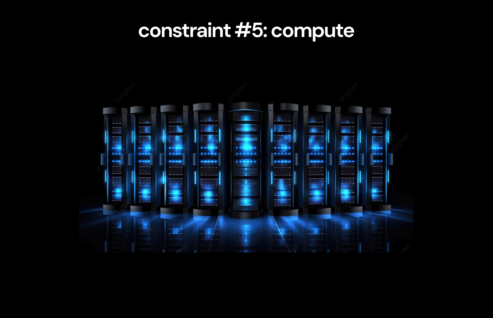
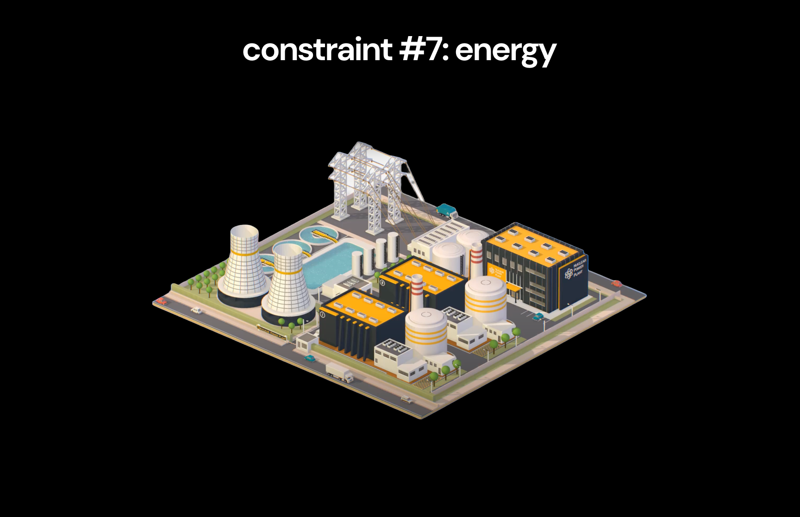

# 深度学习

深入探讨深度学习的整个历史，重点介绍了将我们从简单的前馈网络带到GPT-4o的一系列创新。

对于每一个关键的里程碑，我都在这个仓库中包含了重要的论文，并附上了我的笔记、重要直觉和数学解释，以及相关的pytorch示例实现。

本页面的其余部分是我对我们从这段历史中可以学到的一切的总结，以及它告诉我们关于深度学习未来的启示，灵感来源于[《历史的教训》](https://www.amazon.com/Lessons-History-Will-Durant/dp/143914995X) by Will & Ariel Durant。

> [!IMPORTANT]
>
> **本项目的设计旨在让每个人通过阅读本页面其余部分的概述就能获得大部分价值。**
>
> 然后，想要了解每个创新的技术细节的人，可以通过[资源](#资源)部分的链接，深入探索仓库的其余内容。

> [!NOTE]
>
> 欲了解更多背景信息，请查看[原始的推特线程](https://x.com/MajmudarAdam/status/1794190796411027791)

> [!NOTE]
>
> 感谢[Pavan Jayasinha](https://x.com/pavanjayasinha)和[Anand Majmudar](https://x.com/Almondgodd)在我制作过程中提供的持续反馈 😄

## 目录

- [概述](#overview)
  - [1. 限制](#2-constraints)
    - [1.1. 数据](#11-data)
    - [1.2. 参数](#12-parameters)
    - [1.3. 优化与正则化](#13-optimization--regularization)
    - [1.4. 架构](#14-architecture)
    - [1.5. 计算](#15-compute)
    - [1.6. 计算效率](#16-compute-efficiency)
    - [1.7. 能源](#17-energy)
    - [1.8. 限制与杠杆](#18-constraints--leverage)
  - [2. 叙事](#2-narratives)
  - [3. 灵感](#3-inspiration)
  - [4. 智能](#4-intelligence)
  - [5. 未来](#5-future)
- [资源](#resources)
  - [主题](#topics)
  - [实现](#implementations)
  - [论文](#papers)

 

# 概述

我深入探讨的最有趣部分来自于注意到所有关键进展中存在的一个明显趋势，这彻底改变了我对深度学习的理解：

> [!IMPORTANT]
>
> **有7个简单的限制，限制了数字智能的能力：**
>
> 1. 数据
> 2. 参数
> 3. 优化与正则化
> 4. 架构
> 5. 计算
> 6. 计算效率
> 7. 能源
>
> **深度学习的整个历史可以看作是这些限制逐渐提升的系列进展**，使得越来越智能的系统得以创建。

在不首先理解我们是如何走到今天的之前，我们无法理解我们将要去往何方——而我们也无法理解我们是如何走到今天的，除非理解这些一直主导进展速度的限制。

通过理解这些限制，我们还可以探索一些相关的问题：

- 深度学习是如何进步的？
- 推动深度学习进步的思想源自何处？
- 我们关于数字智能的叙事是如何随着时间变化的？
- 深度学习教会我们关于我们自身智能的哪些东西？
- 深度学习的未来将会如何发展？

那么，让我们从最基本的原理开始，理解这些限制。

# 1. 限制

我们可以将智能定义为准确建模现实的能力[^1]。从实际角度来看，我们关注的是那些对执行具有经济价值的任务有用的现实模型[^2]。

深度学习的目标是通过以下方式为这些有用的任务产生准确的现实模型：

1. 将描述现实的真实模型视为复杂的概率分布[^3]
2. 创建能够建模复杂概率分布的神经网络
3. 训练这些网络以学习建模潜藏于现实背后的概率分布

从这个角度来看，利用深度学习创造智能只需要两个步骤：

1. 收集关于现实的有用信息（收集数据）
2. 创建一个能够有效从这些信息中学习的神经网络（建模数据）

提高我们模型智能的唯一方法就是提升我们完成这两个步骤的能力。

考虑到这一点，我们可以看看支配这个过程的限制。让我们从理解数据的限制开始。

 

[^1]: 每个人对智能的定义不同，这些定义在不同的上下文中都有用，但没有一个能够完整地表达这个词的含义。人们可能会对这个定义的具体内容有所异议。我选择这个定义是为了简洁起见，清楚地框定我们试图通过深度学习从经济角度实现的目标——我在这里不太关心它的哲学含义。

[^2]: Karl Friston的[自由能原理](https://www.nature.com/articles/nrn2787)表明，这一定义的智能在大脑的背景下也是有效的（小心，论文解释时使用了不必要的数学复杂性，但它描述的核心概念是简单的）。值得注意的是，智能系统创建世界模型，然后利用这些模型进行 _主动推理_ 来修改它们的环境。

[^3]: 这个想法一开始可能看起来不直观。但它实际上说的是非常简单的事情：（1）现实有一套规则来支配发生的事情（2）我们可以通过为可能发生的事情分配概率来建模这些规则，考虑到已经发生的事情（3）因此，这些模型是概率分布。再一次，[自由能原理](https://www.nature.com/articles/nrn2787)支持这种现实建模的观点。

## 1.1. 数据

我们已经确定，深度学习的目标是建模描述现实的概率分布。

我们将尝试为特定任务建模的分布称为 _真实分布_。为了了解真实分布，我们从中收集许多样本。这些样本组成了 _数据集_。

数据集包含了关于真实分布的一些信息，但它并不包含 _关于真实分布的所有信息_[^4]。因此，数据集表示的是对真实分布的近似，我们称之为 _经验分布_。

**在最好的情况下，我们可以期望我们的神经网络学会建模这个经验分布[^5]。**

然而，我们最初的目标是建模真实分布。为此，我们需要经验分布**是对真实分布的良好近似**。这个近似的质量决定了在数据集上训练的模型能够达到的上限。

这是神经网络智能的第一个限制。

> [!NOTE]
>
> **限制 #1：模型的好坏只能和其训练数据集的质量相当。**
>
> 具体来说，模型能够逼近真实分布的上限由数据集中包含的关于真实分布的信息量决定。

 

[^4]: 假设我们试图建模的真实分布足够复杂，以至于将其所有信息都包含在数据集中是不切实际的。在深度学习中，这几乎总是成立的。

[^5]: 假设模型完美地表达了数据集中存在的所有信息，但这在实际中几乎不会发生。

### 良好的近似

为了使经验分布更好地逼近真实分布，我们需要在数据集中包含更多关于真实分布的信息。

我们可以通过提高每个样本中所包含的信息量来增加整个数据集的信息量（直观地说，这意味着使用对相关任务更具信息量的样本）。

我们还可以通过添加更多能提供新信息的样本来增加数据集的信息量[^6]。

**简而言之，提高数据集质量有两种方式：**

1. 数据质量  
2. 数据数量

这并不是说更多的数据一定更好[^7]，而是因为我们希望数据集中包含更多关于真实分布的信息，以便模型能够学习到足够好的近似。

在理解了数据这一限制及如何提升数据集质量之后，我们可以进一步探讨，这一维度的进步如何影响了深度学习的发展历程。

 

[^6]: 这类似于泰勒级数中加入更多项可以让函数逼近原始函数的方式。随着关于真实函数的信息增加，近似也会随之改善。

[^7]: 实际上你可以想到一些例子，说明更多数据并不会带来任何变化。例如，在数据集中添加同一张图片（或者两张非常相似的图片）并不会提升模型的质量，因为这些新数据点并没有增加关于真实分布的更多信息。

### 突破 #1：大型标注数据集

早期的机器学习依赖于由各个研究团队收集的数据集。尽管当时已经开发出了一些有效的深度学习方法，但数据集规模不足以证明其优势。

像 [MNIST](https://en.wikipedia.org/wiki/MNIST_database) 和 [ImageNet](https://en.wikipedia.org/wiki/ImageNet) 这样的数据集的引入，极大地提升了高质量大规模数据集的可获取性，从而使深度学习模型能够被有效地训练。

早期的[卷积神经网络（CNN）](/01-deep-neural-networks/02-cnn/03-cnn.ipynb)，如 [LeNet](/01-deep-neural-networks/02-cnn/02-le-net.pdf) 和 [AlexNet](/01-deep-neural-networks/03-alex-net/01-alex-net.pdf)，利用这些数据集证明了深度神经网络可以与当时主流的传统机器学习方法相竞争。

如今我们可能很容易忽视这些数据集的影响，因为它们早已过时——但它们显然对该领域产生了深远的影响。值得注意的是，AlexNet [彻底改变了深度学习领域](/01-deep-neural-networks/03-alex-net/01-alex-net.pdf)，而它的诞生离不开 ImageNet 数据集的创建。

**大型标注数据集的引入可以被视为推动数据限制向更大规模数据集突破的第一次重大突破。**

尽管这些数据集很有用，但由于它们依赖于人工标注，因此在本质上是不可扩展的。为了将数据限制进一步推向更大规模，需要一种全新的数据获取方式。

 

### 突破 #2：解锁互联网

互联网显然是可用于深度学习的大规模数据最丰富的来源。然而，最初并不清楚该如何利用这些数据来训练深度学习模型。

与标注数据集不同，互联网数据并不是为特定任务而创建的，因此它看起来并不包含对训练特定模型有帮助的高质量数据。因此，在很长一段时间里，互联网数据似乎无法用于深度学习[^8]。

[BERT](/04-transformers/02-bert/03-bert.ipynb) 彻底改变了这一局面。BERT 推广了如今所有大语言模型（包括 [GPT系列](/04-transformers/04-gpt/03-gpt.ipynb)）都采用的**迁移学习**范式——模型先在互联网上的大规模数据上进行 _预训练_（数量大、质量不可控），然后再在小规模数据集上进行 _微调_（数量小、质量高）。

**BERT 首次证明了我们实际上可以让互联网规模的数据集变得有用。**

这一成果也震惊了更广泛的科技圈——例如，[促使一位谷歌高管表示](https://x.com/TechEmails/status/1756765277478621620)，未来某个 AI 系统不可避免地将取代 Google 搜索。

如果你感兴趣，[LoRA 论文](/04-transformers/05-lora/02-lora.ipynb)进一步探讨了为什么由 BERT 引入、被所有现代大语言模型采用的迁移学习范式如此有效。

 

[^8]: 很长一段时间里，计算能力不够强大，模型架构也不够优秀，因此难以有效处理互联网规模的数据集。

### 突破 #3：训练助理

[BERT](/04-transformers/02-bert/03-bert.ipynb) 和 [GPT 系列](/04-transformers/04-gpt/03-gpt.ipynb) 在技术上令人印象深刻，但直到 ChatGPT 发布，它们才真正进入主流视野。

[InstructGPT](/04-transformers/06-rlhf/05-rlhf.ipynb) 是促成这一转变的关键突破。它使用 [RLHF（基于人类反馈的强化学习）](/04-transformers/06-rlhf/) 技术，对 GPT-3 基础模型进行微调，微调所使用的数据集是人类生成的高质量问答对，被认为是“一个有用助手应有的良好回应”。

通过学习如何有效地表现得像一个助理，InstructGPT 形成了实用的交流风格，为 ChatGPT 的成功奠定了基础。

**InstructGPT 的成功表明，在微调语言模型时，高质量的数据具有极高的杠杆效应。**

虽然在 instruct 系列出现之前已经存在许多微调模型，但由于训练数据质量极高，InstructGPT 在当时被认为远胜于几乎所有其他模型。

 

### 超越互联网数据

我们还能在多大程度上提升深度学习模型训练数据集的质量，以增强模型变得更智能的能力？

互联网中生成的数据量正以指数级增长，这应该会继续为模型训练提供越来越庞大的数据集来源[^9]。

然而，还有一个问题在于互联网级数据集的质量。我们希望我们的系统能够建模现实，而互联网可以被理解为对现实法则的一种（高度）有损压缩[^10]。

因此，类人机器人的大量普及可能为深度学习模型提供一种全新的数据采集方式，它能直接接触到关于现实的信息——这也使得 [OpenAI 与 Microsoft 对 Figure 的投资与合作](https://www.reuters.com/technology/robotics-startup-figure-raises-675-mln-microsoft-nvidia-other-big-techs-2024-02-29/) 显得格外值得关注。

不过，目前的扩展规律表明，现有模型距离真正挖掘出互联网级数据集中可用信息的极限还相距甚远，这意味着我们距离“数据再次成为限制因素”的那一天，可能还有很长时间。

 

[^9]: 这可能实际上并不足以持续提升模型质量。近期一项关于零样本学习的[分析](https://arxiv.org/abs/2404.04125)显示，大语言模型执行任务的能力随着数据集中相关数据量的增加而呈对数增长。

[^10]: 互联网是对整个人类知识的一种有损压缩，其中包含大量噪声（各种帖子背后复杂且互相矛盾的动机）。此外，人类知识本身也是对现实法则的一种非常有损（且部分不准确）的压缩。

### 数据建模

现在我们已经理解了数据的限制，我们可以探讨是什么限制了神经网络建模数据的有效性。

这决定了模型能够逼近经验分布的程度，进而影响它的智能水平。

决定模型学习经验分布能力的第一个限制是神经网络中的参数数量。

 

## 1.2. 参数

模型需要具有足够的 _表示能力_，才能学习数据集的经验分布。

这意味着神经网络需要有足够的参数，以提供足够的自由度来准确地建模分布。在实践中，预测完全建模一个数据集所需的最小参数数量是具有挑战性的。

然而，当数据集中的信息量远远超出网络能够建模的能力时，提升网络性能的最简单方法就是增加参数数量——这可以通过增加网络的深度以及每一层的参数数量来实现。

对于现代互联网规模的数据集，其复杂性非常巨大，因此在提升模型智能方面，增加参数数量的方法在效率上并没有减缓的迹象。

> [!NOTE]
>
> **限制 #2：模型的表示能力受到其包含的参数数量的限制。**

实际上，我们会发现，增加神经网络中的参数数量实际上是其他限制的函数。

让我们来看一下历史上这个限制特别相关的时刻。

 

### 突破 #1：增加深度

最早的神经网络仅由一个输入层和一个输出层组成，这大大限制了它们的表示能力。

最初的 [反向传播论文](/01-deep-neural-networks/01-dnn/01-dnn.pdf) 讨论了增加一个隐藏层，将更多的参数添加到网络中，从而显著提升了它表示更复杂问题的能力（例如移位寄存器、异或门等——这些都是非常简单的例子，但在当时令人印象深刻）。

[AlexNet](/01-deep-neural-networks/03-alex-net/02-alex-net.ipynb) 是增加参数导致模型表现更好的最明显例子之一[^11]——AlexNet架构使用了5个卷积层，远超当时最大CNN的层数，使得它能够在ImageNet比赛中超越前一最佳成绩。

然而，在早期，网络大小似乎只是众多限制因素中的一个，而非最重要的限制因素。

 

[^11]: 尽管，AlexNet 是多项创新结合的结果，使其如此有效——增加网络深度的同时，还采用了有效的优化与正则化方法，并使用了GPU进行训练，从而使得网络规模的增大成为可能。

### 突破 #2：扩展规律

[GPT](/04-transformers/04-gpt/) 系列明确表明，对于互联网数据集，扩展参数似乎足以显著提升模型质量。

扩展规律没有减缓的迹象，这推动了当前不断尝试训练更大模型的努力。

  

  <i>模型表现随参数变化的扩展规律</i>

**重要的是，这一趋势的原因并不是增加模型中的参数总是能提高其智能。** 相反，这是因为当前的模型仍然没有足够的表示能力来捕捉互联网规模数据集中的所有信息。

如前所述，增加神经网络中的参数实际上是由其他限制因素所决定的。

 

## 1.3. 优化与正则化

实际上，你不能无限制地增加模型中的参数数量，并期望模型质量持续提高。通过增加深度或每层的参数数量来扩展模型，会引入两类新问题。

首先，增加网络的深度可能导致它收敛到最优解的时间大大增加，或者在最坏的情况下，可能会导致网络无法收敛。

**确保模型能够有效收敛，即使它们的深度不断增加，这个过程被称为优化。**

此外，当你扩展模型中的参数数量，使得其表示能力超出了经验分布的复杂性时，模型可能会开始拟合分布中的微不足道的 _噪声_。这一现象被称为 _过拟合_。

**正则化过程用于确保模型学习到数据集的有用 _泛化_，而不是对噪声进行过拟合。**

实际上，网络的实际深度受到所使用的优化与正则化策略有效性的限制。

> [!NOTE]
>
> **限制 #3：优化与正则化方法的有效性限制了网络可以处理的参数数量，同时仍能够收敛并实现泛化。**

 

### 突破 #1：驯服梯度

在使用 [反向传播](/01-deep-neural-networks/01-dnn/02-dnn.ipynb) 训练更深的神经网络时，由于大量或小权重的连续乘积的复合效应，梯度开始被放大或消失[^12]。

**这被称为梯度消失与爆炸问题。**

我们很容易忘记这个问题有多么严重——它完全阻止了超过几层深度的网络的有效训练，极大地限制了网络的规模。

通过 [ResNet](/02-optimization-and-regularization/03-residuals/01-residuals.pdf) 架构引入的 [残差](/02-optimization-and-regularization/03-residuals/02-residuals.ipynb) 完全解决了这个问题，通过为梯度创造了有效的 _残差路径_，使其能够在任意深度的网络中有效流动。

这一解锁移除了网络深度的一个重要限制，使得可以训练更大规模的网络（从而去除了长期存在的参数上限）。

 

[^12]: 理解这一部分需要对反向传播算法的基本原理有所了解。对于任何想学习的人，[3blue1brown的神经网络系列](https://www.youtube.com/playlist?list=PLZHQObOWTQDNU6R1_67000Dx_ZCJB-3pi) 是一个直观有趣的入门介绍。

### 突破 #2：网络中的网络

[Dropout](/02-optimization-and-regularization/04-dropout/) 引入了一种关键的正则化策略，这种策略在其创建后被广泛应用于大多数网络中，特别是在 [AlexNet](/01-deep-neural-networks/03-alex-net/02-alex-net.ipynb) 中起到了重要作用，AlexNet 最初使其广泛流行。

从概念上讲，防止模型对特定问题过拟合的理想方法是训练多个神经网络来解决同一个问题，然后取它们预测的平均值。这一过程会抵消每个网络所拟合的噪声，保留下真实的表示。

然而，这种朴素的方法代价高昂——为一个问题训练多个大型神经网络需要更多的计算资源。

Dropout 提供了一种计算上更有效的等效方法，它通过在每次训练过程中随机屏蔽一部分神经元的作用[^13]，有效地在一个神经网络内训练了大量的子网络，并将它们的预测结果进行平均。

 

[^13]: 这种效果迫使单个神经元学习有助于与其他多种神经元协作的通用表示，而不是与邻近神经元共同适应，这使得大群神经元避免了对噪声的拟合。

### 突破 #3：驯服激活函数

训练深度网络时的另一个问题是，后续层在激活值发生变化时可能会导致其早期训练阶段变得无用，尤其是当前面层的激活值发生变化时，网络的后期层也会遭遇困难。

**这个问题被称为内部协变量偏移**，它也阻止了更深层网络的训练。

[批量归一化](/02-optimization-and-regularization/05-batch-norm/) 和 [层归一化](/02-optimization-and-regularization/06-layer-norm/) 的引入解决了这一问题，通过将神经元激活值强制归入可预测的分布，从而防止了协变量偏移问题。

这一突破，再加上残差方法，为构建更深的网络提供了基础。特别是层归一化，使得训练更深的循环模型（如 [RNNs](/03-sequence-modeling/01-rnn/02-rnn.ipynb) 和 [LSTMs](/03-sequence-modeling/02-lstm/02-lstm.ipynb)）成为可能，这些模型最终推动了 [Transformer](/04-transformers/01-transformer/02-transformer.ipynb) 的创新。

 

### 突破 #4：动量

最初的优化算法 _随机梯度下降_（SGD）涉及在每个时间步长上采取预定的步骤来更新参数。

实际上，这可能是非常低效的，并且会损害收敛速度[^14]。

[Adam](/02-optimization-and-regularization/08-adam/02-adam.ipynb) 优化器引入了一种高效的算法，跟踪**自适应动量**，记录优化过程中梯度的历史。这使得优化器能够根据过去的信息调整步长，通常会导致更快的收敛。

[^14]: 特别是在梯度存在大方差的参数空间中，某个特定的步长可能会导致某些部分的过度调整，而在其他情况下则会导致非常缓慢的变化。

 

### 被遗忘的限制

上述提到的进展（以及相关的发展）目前都被用于大多数模型中。例如，[Transformer](/04-transformers/01-transformer/02-transformer.ipynb) 架构在其整个架构中使用了 [Dropout](/02-optimization-and-regularization/04-dropout/)、[层归一化](/02-optimization-and-regularization/06-layer-norm/02-layer-norm.ipynb) 和 [残差](/02-optimization-and-regularization/03-residuals/02-residuals.ipynb)，并且使用 [Adam](/02-optimization-and-regularization/08-adam/) 优化器进行训练。

由于它们在彻底解决以前的问题上非常有效，优化和正则化现在似乎已经基本解决。

尤其是我们距离当前互联网规模数据集的扩展规律峰值还有很远的距离，因此过拟合不再是一个问题。

**尽管如此，重要的是要记住，优化和正则化仍然是神经网络规模的真实限制**，尽管它们不再影响当前状态下的模型。

 

## 1.4. 架构

我们已经讨论了如何通过增加神经网络中的参数数量来提高其 _表示能力_。这可以理解为网络存储 _有用表示_ 的能力，这些表示有效地建模了经验分布。

默认情况下，深度神经网络被迫学习存储不同问题的表示的最优方法。

然而，当我们已经知道一个有效的方式来存储与特定问题相关的有用表示时，将这种存储方式直接构建到模型中会很有帮助。

**将特定结构构建到神经网络设计中，以便使模型更容易存储有用表示的过程被称为增加归纳偏差。**

为我们的模型设计好的神经网络架构就是为了增加模型中 _有用表示_ 的密度，也就是说，更高效地使用参数。

通过这种方式，改进的架构可以实现与扩展参数类似的效果。

实际上，架构的进步使得以前无法处理的问题（如图像合成）成为可能。

> [!NOTE]
>
> **限制 #4：网络架构的质量限制了模型的表示能力。**

从技术上讲，一个具有非线性的深度神经网络，在参数数量足够的情况下，能够建模任何分布[^15]。

但在实践中，有些分布如此复杂，以至于简单的深度神经网络无法有效地建模它们[^16]。对于这些分布，我们需要依赖架构上的进展来取得进展。

 

[^15]: 这一观点在最初的 [反向传播论文](/01-deep-neural-networks/01-dnn/01-dnn.pdf) 中有探讨。

[^16]: 例如，图像分类，其中单个像素值是噪声的，并且会受到各种变换的影响。

### 突破 #1：学习特征

[卷积神经网络](/01-deep-neural-networks/02-cnn/03-cnn.ipynb) 是第一个有效的架构，它向神经网络中引入了显著的归纳偏差。CNN 背后的思想直接受到大脑视觉系统层次化处理输入的启发。

CNN 使用 _特征图_ 来检测图像中的高级特征，实现了对图像识别任务至关重要的平移不变性。

这为深度学习提供了一个与深度学习之前常用的手动特征工程努力相对应的类比。

CNN 对深度学习的初步采纳至关重要——像 [LeNet](/01-deep-neural-networks/02-cnn/02-le-net.pdf) 和 [AlexNet](/01-deep-neural-networks/03-alex-net/01-alex-net.pdf) 这样的神经网络利用该架构击败了图像分类比赛中的最先进技术。此外，CNN 在现代模型中仍然相关，像 [U-Net](/01-deep-neural-networks/04-u-net/02-u-net.ipynb) 架构被现代的 [扩散模型](/05-image-generation/03-diffusion/05-diffusion.ipynb) 用于图像生成。

 

### 突破 #2：记忆

[循环神经网络](/03-sequence-modeling/01-rnn/02-rnn.ipynb) 引入了存储过去记忆以指导未来决策的能力。

尽管理论上很有趣，但它在序列建模任务中仍然 largely 无效，直到 [长短期记忆](/03-sequence-modeling/02-lstm/02-lstm.ipynb) 架构的出现，LSTM 使得神经网络能够通过学习存储、检索和[遗忘](/03-sequence-modeling/03-learning-to-forget/02-learning-to-forget.ipynb)记忆，来学习跨越时间和空间的复杂关系。

**LSTM 的归纳偏差使得它们在序列建模任务中表现出色，开启了最终导致 Transformer 创建的进展轨迹。**

尽管 LSTM 非常有效，但它仍然受到处理输入序列时按顺序进行的限制，这使得训练速度较慢。

 

### 突破 #3：注意力

[注意力](/03-sequence-modeling/06-attention/02-attention.ipynb) 机制最初是作为 LSTM 的补充，用以增强它们理解概念之间关系的能力。

现在著名的 [_Attention Is All You Need_](/04-transformers/01-transformer/01-transformer.pdf) 论文去除了所有 LSTM 组件，并证明了仅凭注意力的归纳偏差就能有效完成序列建模任务，推出了 [Transformer](/04-transformers/01-transformer/02-transformer.ipynb) 架构，永久改变了深度学习。

**Transformer 特别有效，不仅因为注意力机制的强大，还因为它通过去除循环达到了高并行性。**

 

### 突破 #4：利用随机性

CNN 引入了理解来自复杂图像分布的样本的能力。

然而，图像合成的问题似乎更加困难——CNN 可以学习滤除图像中的细节并关注高层特征，而图像生成模型则需要学习创建高层特征和复杂细节。

像 [变分自编码器](/05-image-generation/02-vae/04-vae.ipynb) 和 [扩散模型](/05-image-generation/03-diffusion/05-diffusion.ipynb) 这样的图像生成模型通过在其架构中直接引入随机采样和噪声，学习生成高层特征和复杂细节。

VAE 创建了一个瓶颈，迫使模型在低维空间中学习有用的表示。然后，它们通过随机采样将噪声添加回这些表示之上。**因此，VAE 首先学习表示，然后再添加噪声。**

**而扩散模型则相反，从噪声开始，逐步学会向噪声中添加信息。**

没有这些设计，现代图像生成模型如 [Stable Diffusion](https://arxiv.org/abs/2112.10752) 和 [DALL E](/05-image-generation/05-dall-e/) 将无法存在。

 

### 突破 #5：嵌入

[Word2Vec](/03-sequence-modeling/04-word2vec/03-word2vec.ipynb) 模型普及了文本嵌入的概念，通过强迫模型为概念创建具有有趣属性的向量表示，从而保持语义和句法的意义。

这种嵌入的力量的一个常用例子是以下方程在嵌入空间中成立：Embedding("King") - Embedding("Man") + Embedding("Woman") = Embedding("Queen")。

嵌入向我们展示了概念之间的关系如何以高度凝练的形式表示。

后来的模型，如基于 [Transformer](/04-transformers/07-vision-transformer/02-vision-transformer.ipynb) 架构的 [CLIP](/05-image-generation/04-clip/02-clip.ipynb)，使得复杂的嵌入空间能够将跨模态的概念理解映射到单一的表示空间，从而实现了像 [DALL E 2](/05-image-generation/05-dall-e/02-dall-e-2.pdf) 这样的多模态模型。

 

### “不要触碰架构”

自从 [Transformer](/04-transformers/01-transformer/02-transformer.ipynb) 引入以来，过去几年的努力主要集中在扩大输入到 Transformer 的参数和数据规模，而没有对归纳偏差进行重大调整。

这表明，架构改进的停滞可能是由于 Transformer 的有效性，或许可以暗示 [注意力](/03-sequence-modeling/06-attention/) 的归纳偏差在智能中的固有有效性。

**这种显著的“不再改变架构”的愿望在 [Andrej Karpathy 的这段视频中](https://www.youtube.com/watch?v=9uw3F6rndnA) 被讨论过。**

许多最先进的模型并没有改变基础架构，而是将不同的现有架构结合在一起——例如，[扩散](/05-image-generation/03-diffusion/05-diffusion.ipynb) 模型设计在底层使用了 [U-Net](/01-deep-neural-networks/04-u-net/02-u-net.ipynb)，而 [DALL-E-2](/05-image-generation/05-dall-e/02-dall-e-2.pdf) 则同时使用了 [CLIP](/05-image-generation/04-clip/02-clip.ipynb)（其构建基于 [Vision Transformer](/04-transformers/07-vision-transformer/02-vision-transformer.ipynb)）和 [扩散](/05-image-generation/03-diffusion/05-diffusion.ipynb) 模型。

不同有效架构的组合还导致了模型的多模态性增强，这在最近 [GPT-4o](https://openai.com/index/hello-gpt-4o/) 的发布中得到了体现，GPT-4o 训练了一个单一的基础模型，涵盖了多种模态（可能在底层结合了多种架构，尽管实现细节尚未发布）。

 

## 1.5. 计算

假设架构高效，优化和正则化有效，模型中总参数数量和表示能力的最后一个限制是**计算能力**。

在训练过程中，需要在每个时间步计算并更新每个参数的梯度，这需要大量计算资源。**因此，随着参数的增多，在反向传播过程中需要进行更多的计算，这成为了限制步骤。**

因为这个原因，单个设备只能同时训练有限数量的参数，超过这个数量后，训练必须扩展到多个设备上，以进行并行化。

**如果我们在训练中能够使用的设备数量有限，那么计算能力就成了限制因素。**

所以我们可以在每个设备上训练一定数量的参数，然后需要更多的设备。如果设备数量的上限有限，那么我们就遇到了计算能力的限制。

> [!NOTE]
>
> **限制 #5：可用的总计算能力限制了模型可训练的最大参数数量。**

实际上，这个限制可能是由资源短缺（购买设备的能力）、供应限制（由于供应链的限制）或能源问题（稍后讨论）造成的[^17]。

 

[^17]: 使用越来越大的设备集群（如 GPU）进行训练还面临许多工程挑战，设备之间需要能够相互通信。

### 突破 #1：计算通信

[AlexNet](/01-deep-neural-networks/03-alex-net/02-alex-net.ipynb) 是最早利用 GPU 并行计算能力来训练神经网络的深度学习应用之一。

他们也是第一批使用多个 GPU 同时训练深度学习模型以加速训练的人。

**他们能够实现这一点，是因为 NVIDIA GPU 最近增加了相互写入彼此内存的能力**，这使得 GPU 之间能够直接进行更快的通信，而不是通过主机进行通信。

这一创新（源自于游戏领域，而非深度学习）在训练大规模模型时变得至关重要，因为大型 GPU 集群之间的通信已成为必不可少的部分。

这篇论文通过几种方式推动了计算能力的限制——首先，仅通过使用 GPU 来进行训练，其次通过使用多个 GPU 分布式训练，并使用 GPU 之间的通信来进一步提升计算效率。

 

### 突破 #2：顺风推动

直到过去十年，推动深度学习取得如此进展的 GPU 并非完全由深度学习的激励推动（深度学习最初为像 NVIDIA 这样的公司提供的收入机会非常有限），而是由游戏市场的顺风推动。

通过这种方式，深度学习从一些运气中受益——游戏行业创造的计算顺风使得深度学习得以腾飞，这种情况在没有游戏行业的推动下可能根本不会发生。

**游戏行业通过创造足够的财务激励，推动了深度学习模型计算能力的提升，从而提升了 GPU 的质量。**

通过一系列论文，你可以看到计算能力随着时间的推移逐渐改善，即使在专门的 AI 计算设施出现之前。

 

### 突破 #3：AI 获得优先考虑

最终，在 2020 年，NVIDIA 发布了专为 AI 应用设计的 A100 模型，因为他们认为 AI 是一个值得下注的战略方向。这个决策现在已经产生了 H100，并很快会有 B100 GPU，这些将为大部分 AI 训练提供动力。

  

  <i>Jensen Huang 向早期的 OpenAI 交付 H200</i>

 

### 突破 #4：计算军备竞赛

最初并不明显，获取计算能力会成为一个巨大的限制因素。

随着 [BERT](/04-transformers/02-bert/01-bert.pdf)、[RoBERTa](/04-transformers/02-bert/02-roberta.pdf)、[GPT-2](/04-transformers/04-gpt/01-gpt-2.pdf) 和 [GPT-3](/04-transformers/04-gpt/02-gpt-3.pdf) 等模型的出现，展现出了规模化参数和计算是提高模型智能的必要因素，这一趋势变得越来越明显。

随着这一趋势变得更加清晰，AI 的叙事也变得越来越强大，大家开始争相获取所需的计算能力，导致了一个之前未曾预料到的需求量。这也造成了获取计算能力的限制。

**此外，获取大量计算能力的原始成本对于大多数公司来说已变得极为昂贵。**

这些计算能力的限制使得 [Sam Altman 说道“计算能力将成为未来的货币。”](https://www.youtube.com/watch?v=r2UmOBrrRK8)

[扎克伯格花费了数十亿美元购买了 350,000 台 NVIDIA GPU](https://www.pcmag.com/news/zuckerbergs-meta-is-spending-billions-to-buy-350000-nvidia-h100-gpus)，鉴于当前获取计算资源的困难，这一举动现在看来是极具前瞻性的。

对计算资源的需求增加，也反映在了 NVIDIA 计算供应链中所有关键公司（包括 TSMC 和 ASML）的市值激增中。

 

### 调整供应链

当前对计算能力的限制部分是由于计算供应链未能预料到 AI 热潮带来的需求激增。

随着供应链不可避免地调整以满足这些需求，这一限制很可能会从谁已经获得了最多的计算能力转变为谁拥有资源购买最多的计算能力，这也使得 OpenAI 在考虑与资源充足的微软合作时处于有利位置。

 

### AI 专用集成电路（ASICs）

在最近的募资周期中，许多初创公司筹集资金，计划为推理和训练构建专用的 AI 芯片，承诺进一步提升训练大规模模型的效率。

这些专用芯片，广义上被称为**应用特定集成电路（ASICs）**，将深度学习模型的工作方式直接假设到硬件中，提供了大幅加速训练的能力。

问题在于，其他公司能否在这个领域竞争，还是 NVIDIA 将继续主导 AI 训练市场（最有可能如此）。

 

## 1.6. 计算效率

尽管计算能力在增加，但如何有效地利用这些计算能力并不是自动保证的。高效使用计算能力是一个软件问题，需要积极的努力和优化。

像 [FlashAttention](https://arxiv.org/abs/2205.14135) 这样的创新，通过优化注意力访问内存的方式，极大地加速了 Transformer 的速度，它提醒我们，计算优化是提高训练效率和扩大模型规模的另一个杠杆。

> [!NOTE]
>
> **限制 #6：训练的软件实现限制了计算利用效率。**

 

### 突破 #1：CUDA

最初，GPU 的使用非常具有挑战性，因为它们依赖于一种完全新的编程范式。

[CUDA](https://en.wikipedia.org/wiki/CUDA) 的引入，为 C 程序员提供了一种熟悉的 GPU 编程范式，使得编写 GPU 代码变得更加易于接触。

这种语言使得 [AlexNet](/01-deep-neural-networks/03-alex-net/01-alex-net.pdf) 能够手动实现自己的内核，从而加速了 GPU 上的卷积操作，为训练 CNN 打开了新的并行化层次。

 

### 突破 #2：内核库

如今，人们很少需要编写低级内核，因为像 [PyTorch](https://pytorch.org/) 和 [JAX](https://github.com/google/jax) 这样的流行库已经为最常用的内核编写了代码，这使得现代深度学习工程师能够轻松使用 GPU，而不需要深入到低级代码中。

 

### 持续改进

尽管 GPU 内核现在大多已经编写完成，但仍然存在许多提升模型实现计算效率的机会——特别是，[FlashAttention](https://arxiv.org/abs/2205.14135) 的引入展示了这些变化在训练效率方面可能带来的巨大差异。

 

## 1.7. 能源

**最后，即使计算供应链能够支持所有需求，并且我们有无限的资源购买计算能力，计算仍然有一个限制：能源。**

实际上，大规模的训练运行需要在大型数据中心的物理集群计算上进行，因为设备需要相互通信。

随着大规模训练运行中设备数量的增加，数据中心将需要能够支持这些设备的能源需求。

这可能实际上成为一个重要的限制，正如 [Zuck 在 Dwarkesh 播客中的这段访谈中讨论的那样](https://www.youtube.com/watch?v=i-o5YbNfmh0)。

具体来说，能源网的供电能力在某个地点是有限的，这意味着数据中心的规模会遇到瓶颈，超出这个瓶颈后需要进行能源许可，并且进入更慢的政府监管流程。

> [!NOTE]
>
> **限制 #7：在单一地点从电网获取的能源量限制了用于训练运行的计算能力。**

随着许多公司计划为 AI 训练建设大型数据中心，我们将看到能源限制如何发挥作用——特别是，传闻称 [微软和 OpenAI 正在计划一个 1000 亿美元的数据中心项目](https://www.reuters.com/technology/microsoft-openai-planning-100-billion-data-center-project-information-reports-2024-03-29/)。

 

## 1.8. 限制与杠杆

在逐个讲解每个限制之后，我们现在可以将它们与深度学习进步的整体趋势相对照。

**一个有帮助的思考框架是将这7个限制分为 _硬限制_ 和 _杠杆_ 。**

硬限制是**数据**、**计算**和**能源**——这些都受到慢速过程的限制——数据目前受到互联网扩展增长和其他数据收集方法的限制，计算受到单个公司资源和供应链的限制，能源限制最终将受到监管的速度限制。

同时，**参数**、**优化与正则化**、**架构**和**计算效率**可以看作是对硬限制的**杠杆**——它们都是容易变化的，可以在给定固定数据、计算和能源的情况下进行优化，以最大化模型的智能。

**最大化杠杆限制对单次训练运行非常重要，但真正推动模型基础智能不断提升的是改善硬限制。**

这再次表明了扩展规律——我们的模型还没有显示出接近完全建模当前互联网规模数据集中的信息的迹象，因此我们继续通过增加 _计算_ 和 _参数_ 来扩展模型。

 

# 2. 叙事

我们可以通过限制的视角回顾深度学习的进步历史，看到一些关键的里程碑，它们脱颖而出，完全改变了围绕深度学习的叙事。

由于叙事是分配资本和人才以解决问题的强大工具[^18]，这些叙事的转变本身对深度学习的进展产生了显著影响。

 

[^18]: 对于感兴趣的读者，[Kevin Kwok 关于叙事提炼的文章](https://kwokchain.com/2021/09/29/narrative-distillation-1/) 是一次精彩的探讨，讲述了叙事在资本和资源分配中的力量。

### 叙事 #1：深度学习有效

深度学习的第一个重大叙事转变发生在 2012 年 [AlexNet](/01-deep-neural-networks/03-alex-net/01-alex-net.pdf) 发布之后。

在此论文之前，深度学习被认为不如传统机器学习，因为它在图像分类和其他挑战中始终落后于手动特征工程方法。

AlexNet 的成功将 ImageNet 挑战赛中的 top-5 错误率从 25.8% 降至 16.4%，彻底打破了之前的最先进技术。

这直接促成了像 [GoogLeNet](https://arxiv.org/abs/1409.4842) 和 [ResNet](/02-optimization-and-regularization/03-residuals/02-residuals.ipynb) 等进一步的创新，但更重要的是，它让深度学习重新获得了关注，并为该领域创造了新的兴趣。

这一工作的叙事转变，从对深度学习效用的怀疑转变为相信它是一种可行的，甚至优于传统机器学习的方法。

这一叙事转变对我们今天所处的地位至关重要，而且看起来 Ilya Sutskever（AlexNet 的共同作者）在共识达成之前就已经意识到扩展规律将如何发展，正如 [在与 Geoffrey Hinton 的这次访谈中讨论的](https://www.youtube.com/watch?v=n4IQOBka8bc)。

 

### 叙事 #2：互联网规模数据

[_Attention Is All You Need_](/04-transformers/01-transformer/02-transformer.ipynb) 论文创造了一个大规模并行化架构，使得在互联网规模数据集上进行训练成为可能。

然而，仅仅是 Transformer 的引入并没有产生最大的叙事转变。

可以说，真正展示 Transformer 如何通过预训练和微调利用从互联网抓取的大规模数据集的，是 [BERT](/04-transformers/02-bert/03-bert.ipynb) 的出现，这推动了现代 AI 领域的趋势，专注于实现通用智能。

由于其迁移学习方法，BERT 在许多 NLP 任务中取得了最先进的结果，而无需显式地进行训练，这展示了某种形式的 _通用_ 智能的初步迹象。

BERT 带来的震撼可以从 [谷歌高管的声明](https://x.com/TechEmails/status/1756765277478621620) 中看出，声明称 BERT 将取代搜索产品 20 年来的所有进展。

 

### 叙事 #3：扩展规律

从 [GPT-2](/04-transformers/04-gpt/01-gpt-2.pdf) 到 [GPT-3](/04-transformers/04-gpt/02-gpt-3.pdf) 的进展所定义的进步箭头创造了主导当前公众情绪的扩展规律叙事。

重要的是，OpenAI 早期就对扩展规律进行了押注，远在这些规律被广泛认可为有效之前[^19]。几年前，大多数人认为扩展规律是天真的。

现在，回顾过去，它们显得很清晰，因为 OpenAI 通过一系列的押注验证了这些规律，GPT-2 和 GPT-3 进一步验证了他们的假设。

**正确推断扩展规律的进展是具有挑战性的**——正如 [Zuck 在这段视频中指出的](https://www.youtube.com/watch?v=i-o5YbNfmh0)，像这样的趋势很少会一直持续到我们达到目标——我们通常会遇到瓶颈，然后不得不重新调整策略。

在这种背景下，问题在于互联网数据集的经验分布能够带我们走多远。换句话说——互联网的经验分布离真实的现实模型分布有多近？

这将决定我们何时在通过扩展参数进行训练时，达到模型能通过训练在互联网上变得更强的承载能力。

**这一叙事也是筹集资金时叙事影响力的一个良好指标。**

AGI 叙事可能是历史上最强大的叙事，因为它可以声称“所有其他经济上有价值的问题都将通过这个问题解决。”

显然，这在 [传闻中的 7 万亿美元 OpenAI 募资尝试](https://www.wsj.com/tech/ai/sam-altman-seeks-trillions-of-dollars-to-reshape-business-of-chips-and-ai-89ab3db0) 中得到了有效运用（当然这只是传闻，但它表明了 AGI 叙事的力量，因为人们相信它是一个可能性）。

 

[^19]: 从 Theil 术语来看，你可以将其框定为 OpenAI 的“秘密”或是他们认为别人没有的东西。

# 3. 灵感

推动深度学习突破的思想来源于哪里？

当我们回顾进步的历史时，我们可以看到几个常见的灵感来源，它们经常出现在各个阶段。

 

### 神经科学

深度学习许多进展的最直接灵感来源是神经科学。

[卷积神经网络](/01-deep-neural-networks/02-cnn/01-cnn.pdf) 几乎直接受大脑视觉系统的启发，并且促成了深度学习的重大进展。

类似地，[ReLU](/02-optimization-and-regularization/02-relu/) 的有效性可以通过大脑中稀疏表示概念的能效来解释。

其他系统，如 [LSTM](/03-sequence-modeling/02-lstm/02-lstm.ipynb) 和 [注意力](/03-sequence-modeling/06-attention/02-attention.ipynb) 机制，表面上似乎从神经科学概念（记忆和注意力）中汲取灵感，尽管实际上，它们的实现更多是受到神经网络数学和工程问题的推动，而不是直接模仿大脑。

例如，LSTM 设计完美地解决了 RNN 中的梯度消失与爆炸问题，而事实上，基于长期记忆的系统是解决这个问题的有效方式。

这一模式表明，与其直接从神经科学中获取灵感，**深度学习可能已经在第一原理的基础上，趋向于与大自然在大脑中构建智能的方式类似的方法**。

这是一个不错的事后理性化，但可能过于构建了一个干净的叙事，这并不完全反映实际情况。

此外，早期的论文似乎故意给人一种压力，把思想与神经科学和生物学的解释对接，即使在那些地方可能并没有这种必要性。

[Dropout](/02-optimization-and-regularization/04-dropout/02-dropout.ipynb) 给我的感觉是这种现象的最明显例子，因为他们解释了“可能的动机”来自于动物性行为，尽管他们在论文中的解释显示 dropout 是从正则化的逻辑思路出发的。

这似乎是试图让架构在设计后看起来与生物学相符，而不是它实际上是灵感的来源（当然，我也可能错了）。

 

### 线性代数与微积分

最显著的例子是，[反向传播](/01-deep-neural-networks/01-dnn/02-dnn.ipynb) 和 [LoRA](/04-transformers/05-lora) 直接受神经网络背后数学的启发。

LoRA（低秩适应）直接利用线性代数中的一个特性，通过将权重矩阵分解为维度更低、参数更少的矩阵，从而调整模型的训练方式。

类似地，[残差](/02-optimization-and-regularization/03-residuals/02-residuals.ipynb) 等进展直接受到神经网络中梯度流动性质的启发。

 

### 物理学与信息论

特别地，[变分自编码器](/05-image-generation/02-vae/04-vae.ipynb) 和 [扩散](/05-image-generation/03-diffusion/05-diffusion.ipynb) 模型受到热力学的启发——具体来说，是朗之万动力学，以及概率与信息论。

这些系统涉及噪声采样，这些模型借鉴了现实世界中类似噪声系统的处理方法作为灵感来源。

 

### 工程学

实际上，深度学习中的大多数创新实际上更多地受到神经网络设计中的工程问题的推动，与表面上的灵感领域仅有表面相似性。

 

# 4. 智能

深度学习的进步可以告诉我们什么关于我们自身智能的信息？

我会尽量保持纯粹的经验性讨论，因为考虑到这个话题的主观性，它很容易引发没有依据的哲学性思考。

正如我们讨论过的，一种看待智能的方式（受到 [自由能原理](https://www.nature.com/articles/nrn2787) 的启发）是将其视为我们建模描述现实的复杂分布的能力的度量，然后基于这些模型进行主动推理，从而在世界上实现目标[^20]。

似乎，现实数据（数据集与我们的感官）、计算能力（晶体管与神经元）、能源（电力与食物）以及规模（参数与连接）结合起来，再加上有效的学习算法，能够产生看起来智能的系统。

此外，不同架构提供的各种归纳偏差的有效性，可能揭示了它们试图建模的信息结构的某种内在特征。

例如，注意力机制的有效性引发了一个问题：为什么仅仅这种归纳偏差在建模数据时如此有效？

如果智能真的只是数据、计算、能源和训练的函数，那么现在看起来不可避免的是，数字智能很快就会超过我们。

 

[^20]: 这种智能的看法也很好地描绘了 WaitButWhy 博客文章 [The Cook and the Chef: Musk's Secret Sauce](https://waitbutwhy.com/2015/11/the-cook-and-the-chef-musks-secret-sauce.html) 中的思维框架。

# 5. 未来

我们现在已经将进步的历史重新构建为一系列不断提升限制的进展，这些限制主导着数字智能的方向。

过去所有推动进展的因素都受到了上述讨论的限制的决定。

重要的是，未来这一切不会发生改变——**这七个限制将永远决定我们的前进方向，以及我们离 AGI 的距离[^21]。**

到目前为止，我们已经解决了 AGI 的 _理论问题_，因为我们已经完全清楚了能够带领我们走向 AGI 的路径[^22]。

在过去的十年里，这一点并不显而易见，我们已经看到了深度学习能走得多远的力量。

现在的问题是我们是否能解决 AGI 的 _工程问题_。我们能否持续推动所有限制，继续提高数字智能？

虽然扩展规律目前仍在起作用，而当前的前进道路是获取更多的计算资源来训练更大的模型，但这种方法的有效性将在未来遇到限制（很难知道何时）。

有可能我们会基于互联网的经验分布的质量，遇到模型的表现达到瓶颈，在这种情况下，我们将不得不寻求其他数据来源。

> [!IMPORTANT]
>
> 重要的是要记住，深度学习进步的核心原则是，推动这七个限制将导致越来越智能的系统。
>
> 尽管扩展规律表明当前的限制因素是计算和参数，但随着时间的推移，这些限制可能会转向数据和能源，这将带来新的挑战。

 

[^21]: 这并不是说扩展规律将带领我们走向 AGI，而是说不断推动这些限制会让我们接近 AGI。我们可能会遇到瓶颈，这些瓶颈将使扩展规律在某个时刻变得过时。
[^22]: 假设你相信当前的系统表现出智能行为，虽然仍有一些人对此持不同意见。

# 资源

## 主题

> [!IMPORTANT]
>
> 本仓库中突出的每个主题都在下方链接的文件夹中进行了详细覆盖。
>
> 在每个文件夹中，您将找到与主题相关的关键论文副本（`.pdf` 文件），以及我对直觉、数学和实现的拆解（相关内容将在 `.ipynb` 文件中提供）。

**1. 深度神经网络**

- [1.1. DNN](/01-deep-neural-networks/01-dnn/)
- [1.2. CNN](/01-deep-neural-networks/02-cnn/)
- [1.3. AlexNet](/01-deep-neural-networks/03-alex-net/)
- [1.4. UNet](/01-deep-neural-networks/04-u-net/)

**2. 优化与正则化**

- [2.1. 权重衰减](/02-optimization-and-regularization/01-weight-decay/)
- [2.2. ReLU](/02-optimization-and-regularization/02-relu/)
- [2.3. 残差](/02-optimization-and-regularization/03-residuals/)
- [2.4. Dropout](/02-optimization-and-regularization/04-dropout/)
- [2.5. 批量归一化](/02-optimization-and-regularization/05-batch-norm/)
- [2.6. 层归一化](/02-optimization-and-regularization/06-layer-norm/)
- [2.7. GELU](/02-optimization-and-regularization/07-gelu/)
- [2.8. Adam](/02-optimization-and-regularization/08-adam/)

**3. 序列建模**

- [3.1. RNN](/03-sequence-modeling/01-rnn/)
- [3.2. LSTM](/03-sequence-modeling/02-lstm/)
- [3.3. 学习遗忘](/03-sequence-modeling/03-learning-to-forget/)
- [3.4. Word2Vec & Phrase2Vec](/03-sequence-modeling/04-word2vec/)
- [3.5. Seq2Seq](/03-sequence-modeling/05-seq2seq/)
- [3.6. 注意力](/03-sequence-modeling/06-attention/)
- [3.7. 专家混合](/03-sequence-modeling/07-mixture-of-experts/)

**4. Transformer**

- [4.1. Transformer](/04-transformers/01-transformer/)
- [4.2. BERT](/04-transformers/02-bert/)
- [4.3. T5](/04-transformers/03-t5)
- [4.4. GPT-2 & GPT-3](/04-transformers/04-gpt)
- [4.5. LoRA](/04-transformers/05-lora)
- [4.8. RLHF & InstructGPT](/04-transformers/06-rlhf)
- [4.9. Vision Transformer](/04-transformers/07-vision-transformer)

**5. 图像生成**

- [5.1. GANs](/05-image-generation/01-gan/)
- [5.2. VAEs](/05-image-generation/02-vae/)
- [5.3. 扩散模型](/05-image-generation/03-diffusion/)
- [5.4. CLIP](/05-image-generation/05-clip/)
- [5.5. DALL E & DALL E 2](/05-image-generation/06-dall-e/)

 

## 实现

我在本仓库中提供了许多核心主题的最小实现，这些实现可以在每个主题的 `.ipynb` 文件中找到。

通常，你可以在网上找到大多数论文的优秀实现，这意味着挑战并不是重新实现它们。我将这些实现汇集在一个地方，方便查阅，并且突出了展示每个概念的简单实现，方便我进行训练和学习。

我使用了 A100 GPU 来训练大多数更大的模型。

- [DNN](/01-deep-neural-networks/01-dnn/02-dnn.ipynb)
- [CNN](/01-deep-neural-networks/02-cnn/03-cnn.ipynb)
- [Transformer](/04-transformers/01-transformer/02-transformer.ipynb)
- [LoRA](/04-transformers/05-lora/02-lora.ipynb)
- [Vision Transformer](/04-transformers/07-vision-transformer/02-vision-transformer.ipynb)
- [GAN](/05-image-generation/01-gan/02-gan.ipynb)
- [VAE](/05-image-generation/02-vae/04-vae.ipynb)
- [Diffusion](/05-image-generation/03-diffusion/05-diffusion.ipynb)

 

## 论文

**深度神经网络**

- **DNN** - Learning Internal Representations by Error Propagation (1987), D. E. Rumelhart et al. [[PDF]](https://stanford.edu/~jlmcc/papers/PDP/Volume%201/Chap8_PDP86.pdf)
- **CNN** - Backpropagation Applied to Handwritten Zip Code Recognition (1989), Y. Lecun et al. [[PDF]](http://yann.lecun.com/exdb/publis/pdf/lecun-89e.pdf)
- **LeNet** - Gradient-Based Learning Applied to Document Recognition (1998), Y. Lecun et al. [[PDF]](http://vision.stanford.edu/cs598_spring07/papers/Lecun98.pdf)
- **AlexNet** - ImageNet Classification with Deep Convolutional Networks (2012), A. Krizhevsky et al. [[PDF]](https://papers.nips.cc/paper_files/paper/2012/file/c399862d3b9d6b76c8436e924a68c45b-Paper.pdf)
- **U-Net** - U-Net: Convolutional Networks for Biomedical Image Segmentation (2015), O. Ronneberger et al. [[PDF]](https://arxiv.org/abs/1505.04597)

**优化与正则化**

- **权重衰减** - A Simple Weight Decay Can Improve Generalization (1991), A. Krogh and J. Hertz [[PDF]](https://proceedings.neurips.cc/paper/1991/file/8eefcfdf5990e441f0fb6f3fad709e21-Paper.pdf)
- **ReLU** - Deep Sparse Rectified Neural Networks (2011), X. Glorot et al. [[PDF]](https://www.researchgate.net/publication/215616967_Deep_Sparse_Rectifier_Neural_Networks)
- **残差** - Deep Residual Learning for Image Recognition (2015), K. He et al. [[PDF]](https://arxiv.org/pdf/1512.03385)
- **Dropout** - Dropout: A Simple Way to Prevent Neural Networks from Overfitting (2014), N. Strivastava et al. [[PDF]](https://www.cs.toronto.edu/~rsalakhu/papers/srivastava14a.pdf)
- **批量归一化** - Batch Normalization: Accelerating Deep Network Training by Reducing Internal Covariate Shift (2015), S. Ioffe and C. Szegedy [[PDF]](https://arxiv.org/pdf/1502.03167)
- **层归一化** - Layer Normalization (2016), J. Lei Ba et al. [[PDF]](https://arxiv.org/pdf/1607.06450)
- **GELU** - Gaussian Error Linear Units (GELUs) (2016), D. Hendrycks and K. Gimpel [[PDF]](https://arxiv.org/pdf/1606.08415)
- **Adam** - Adam: A Method for Stochastic Optimization (2014), D. P. Kingma and J. Ba [[PDF]](https://arxiv.org/pdf/1412.6980)

**序列建模**

- **RNN** - A Learning Algorithm for Continually Running Fully Recurrent Neural Networks (1989), R. J. Williams [[PDF]](https://gwern.net/doc/ai/nn/rnn/1989-williams-2.pdf)
- **LSTM** - Long-Short Term Memory (1997), S. Hochreiter and J. Schmidhuber [[PDF]](https://www.bioinf.jku.at/publications/older/2604.pdf)
- **学习遗忘** - Learning to Forget: Continual Prediction with LSTM (2000), F. A. Gers et al. [[PDF]](https://citeseerx.ist.psu.edu/document?repid=rep1&type=pdf&doi=e10f98b86797ebf6c8caea6f54cacbc5a50e8b34)
- **Word2Vec** - Efficient Estimation of Word Representations in Vector Space (2013), T. Mikolov et al. [[PDF]](https://arxiv.org/pdf/1301.3781)
- **Phrase2Vec** - Distributed Representations of Words and Phrases and their Compositionality (2013), T. Mikolov et al. [[PDF]](https://arxiv.org/pdf/1310.4546)
- **Encoder-Decoder** - Learning Phrase Representations using RNN Encoder-Decoder for Statistical Machine Translation (2014), K. Cho et al. [[PDF]](https://arxiv.org/pdf/1406.1078)
- **Seq2Seq** - Sequence to Sequence Learning with Neural Networks (2014), I. Sutskever et al. [[PDF]](https://arxiv.org/pdf/1409.3215)
- **Attention** - Neural Machine Translation by Jointly Learning to Align and Translate (2014), D. Bahdanau et al. [[PDF]](https://arxiv.org/pdf/1409.0473)
- **专家混合** - Outrageously Large Neural Networks: The Sparsely-Gated Mixture-of-Experts Layer (2017), N. Shazeer et al. [[PDF]](https://arxiv.org/pdf/1701.06538)

**Transformer**

- **Transformer** - Attention Is All You Need (2017), A. Vaswani et al. [[PDF]](https://arxiv.org/pdf/1706.03762)
- **BERT** - BERT: Pre-training of Deep Bidirectional Transformers for Language Understanding (2018), J. Devlin et al. [[PDF]](https://arxiv.org/pdf/1810.04805)
- **RoBERTa** - RoBERTa: A Robustly Optimized BERT Pretraining Approach (2019), Y. Liu et al. [[PDF]](https://arxiv.org/pdf/1907.11692)
- **T5** - Exploring the Limits of Transfer Learning with a Unified Text-to-Text Transformer (2019), C. Raffel et al. [[PDF]](https://arxiv.org/pdf/1910.10683)
- **GPT-2** - Language Models are Unsupervised Multitask Learners (2018), A. Radford et al. [[PDF]](https://d4mucfpksywv.cloudfront.net/better-language-models/language_models_are_unsupervised_multitask_learners.pdf)
- **GPT-3** - Language Models are Few-Shot Learners (2020) T. B. Brown et al. [[PDF]](https://arxiv.org/pdf/2005.14165)
- **LoRA -** LoRA: Low-Rank Adaptation of Large Language Models (2021), E. J. Hu et al. [[PDF]](https://arxiv.org/pdf/2106.09685)
- **RLHF** - Fine-Tuning Language Models From Human Preferences (2019), D. Ziegler et al. [[PDF]](https://arxiv.org/pdf/1909.08593)
- **PPO** - Proximal Policy Optimization Algorithms (2017), J. Schulman et al. [[PDF]](https://arxiv.org/pdf/1707.06347)
- **InstructGPT** - Training language models to follow instructions with human feedback (2022), L. Ouyang et al. [[PDF]](https://arxiv.org/pdf/2203.02155)
- **Helpful & Harmless** - Training a Helpful and Harmless Assistant with Reinforcement Learning from Human Feedback (2022), Y. Bai et al. [[PDF]](https://arxiv.org/pdf/2204.05862)
- **Vision Transformer** - An Image is Worth 16x16 Words: Transformers for Image Recognition at Scale (2020), A. Dosovitskiy et al. [[PDF]](https://arxiv.org/pdf/2010.11929)

**生成模型**

- **GAN** - Generative Adversarial Networks (2014), I. J. Goodfellow et al. [[PDF]](https://arxiv.org/pdf/1406.2661)
- **VAE** - Auto-Encoding Variational Bayes (2013), D. Kingma and M. Welling [[PDF]](https://arxiv.org/pdf/1312.6114)
- **VQ VAE** - Neural Discrete Representation Learning (2017), A. Oord et al. [[PDF]](https://arxiv.org/pdf/1711.00937)
- **VQ VAE 2** - Generating Diverse High-Fidelity Images with VQ-VAE-2 (2019), A. Razavi et al. [[PDF]](https://arxiv.org/pdf/1906.00446)
- **Diffusion** - Deep Unsupervised Learning using Nonequilibrium Thermodynamics (2015), J. Sohl-Dickstein et al. [[PDF]](https://arxiv.org/pdf/1503.03585)
- **去噪扩散** - Denoising Diffusion Probabilistic Models (2020), J. Ho. et al. [[PDF]](https://arxiv.org/pdf/2006.11239)
- **去噪扩散 2** - Improved Denoising Diffusion Probabilistic Models (2021), A. Nichol and P. Dhariwal [[PDF]](https://arxiv.org/pdf/2102.09672)
- **Diffusion Beats GANs** - Diffusion Models Beat GANs on Image Synthesis, P. Dhariwal and A. Nichol [[PDF]](https://arxiv.org/pdf/2105.05233)
- **CLIP** - Learning Transferable Visual Models From Natural Language Supervision (2021), A. Radford et al. [[PDF]](https://arxiv.org/pdf/2103.00020)
- **DALL E** - Zero-Shot Text-to-Image Generation (2021), A. Ramesh et al. [[PDF]](https://arxiv.org/pdf/2102.12092)
- **DALL E 2** - Hierarchical Text-Conditional Image Generation with CLIP Latents (2022), A. Ramesh et al. [[PDF]](https://arxiv.org/pdf/2204.06125)
